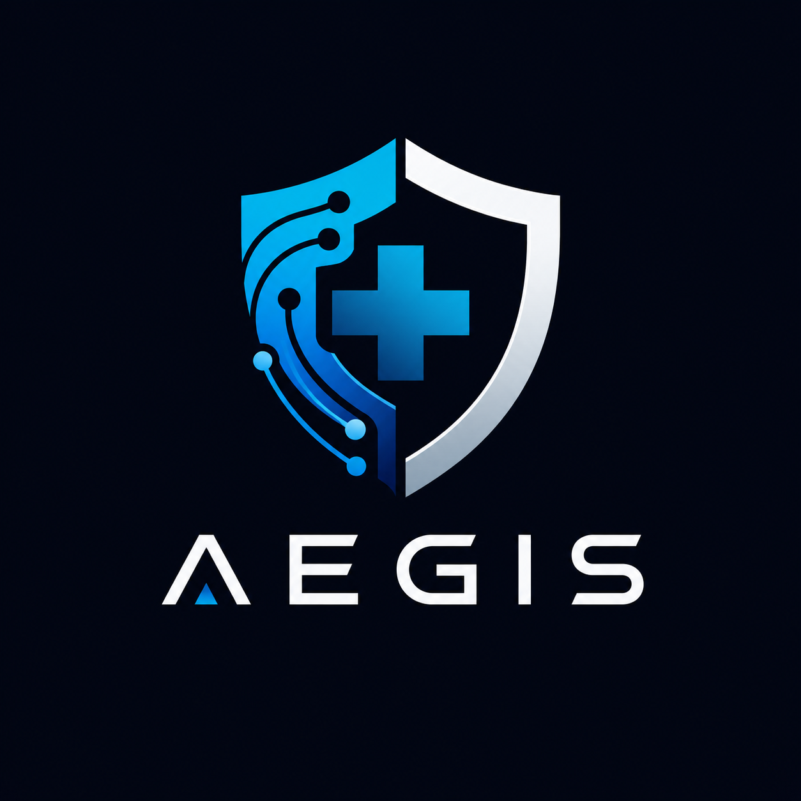

<div align="center">

# AEGIS
### Decentralized Federated Medical AI Ecosystem




---

### Privacy-Preserving • Federated • Trust-Aware • Blockchain-Validated

</div>

---

# Overview

AEGIS is a next-generation decentralized medical AI ecosystem designed for privacy-preserving federated intelligence.

The system enables hospitals, labs, clinics, edge devices, and research centers to collaboratively improve AI models without sharing raw patient data.

Instead of centralized AI training, AEGIS uses:

- Federated Learning
- Selective LoRA Adaptation
- Trust-Aware Aggregation
- Blockchain Validation
- Differential Privacy
- DP-RAG
- gRPC Communication
- Tensor Risk Evaluation
- Multi-Agent Hierarchical Intelligence

---

# Core Vision

Traditional medical AI systems require centralized patient data collection, creating major concerns:

- Privacy violations
- Data breaches
- Single point of failure
- Lack of transparency
- Expensive centralized infrastructure

AEGIS solves this by creating a distributed ecosystem where:

- Data stays local
- Models learn collaboratively
- Edge devices participate
- Trust is continuously evaluated
- Blockchain validates interactions
- Medical AI becomes scalable and secure

---

# System Architecture

```text
                ┌────────────────────────┐
                │   Blockchain Network   │
                │ Server Validation Mesh │
                └──────────┬─────────────┘
                           │
        ┌──────────────────┼──────────────────┐
        │                  │                  │
 ┌──────▼──────┐   ┌──────▼──────┐   ┌──────▼──────┐
 │  Server S1  │   │  Server S2  │   │  Server S3  │
 │ Aggregation │   │ Validation  │   │ Heartbeats  │
 └──────┬──────┘   └──────┬──────┘   └──────┬──────┘
        │                  │                  │
════════════════ gRPC Secure Mesh ════════════════
        │                  │                  │
 ┌──────▼──────┐   ┌──────▼──────┐   ┌──────▼──────┐
 │ Client Node │   │ Client Node │   │ Client Node │
 │ Hospital A  │   │ Clinic B    │   │ Edge Device │
 └─────────────┘   └─────────────┘   └─────────────┘
```

---

# Key Features

## Privacy-Preserving Federated Learning

- Raw medical data never leaves client devices
- Only LoRA updates are transmitted
- Secure distributed aggregation

---

## Selective LoRA Training

Instead of training full models:

- Only selected layers are fine-tuned
- Enables low-resource edge participation
- Reduces communication overhead
- Makes training possible on:
  - mobile devices
  - laptops
  - edge servers
  - IoT medical devices

---

## Blockchain-Based Validation

AEGIS introduces decentralized validation:

- Multiple servers validate updates
- Immutable audit trails
- Byzantine-resistant verification
- Randomized server selection
- Transparent aggregation history

---

## gRPC Communication Layer

High-performance communication stack using:

- HTTP/2
- Protocol Buffers
- Secure encrypted channels
- Low-latency transmission

---

## Tensor Risk Evaluation

Incoming updates are classified as:

- Safe
- Sensitive
- Risky

Tensor evaluation considers:

- Gradient magnitude
- Directional similarity
- Anomaly detection
- Poisoning attack detection

---

## Heartbeat Consistency Monitoring

Clients periodically send heartbeat signals.

The system evaluates:

- Participation consistency
- Timing stability
- Reliability behavior
- Long-term trustworthiness

---

## Reputation & Scoring System

Every client has a continuously updated trust score based on:

- Heartbeat consistency
- Tensor quality
- Blockchain validation agreement
- Historical reliability

Low-quality participants are automatically isolated.

---

## DP-RAG (Differentially Private RAG)

Client-side Retrieval-Augmented Generation with:

- Local vector databases
- Controlled noise injection
- Reduced hallucination
- Privacy-aware retrieval

---

## FHIR Medical Interoperability

AEGIS supports:

- HL7 FHIR
- Secure medical data portability
- Cross-hospital interoperability
- Standardized healthcare exchange

---

# Hierarchical Agent Architecture

## Layered Agent Hierarchy

```text
                    ┌────────────────────┐
                    │  AEGIS CORE AI     │
                    │ Global Intelligence│
                    └─────────┬──────────┘
                              │
              ┌───────────────┼───────────────┐
              │               │               │
      ┌───────▼───────┐ ┌────▼────┐ ┌────────▼────────┐
      │ Aggregation   │ │Security │ │Validation Agent│
      │ Agent         │ │Agent    │ │Network          │
      └───────┬───────┘ └────┬────┘ └────────┬────────┘
              │              │                │
══════════════╪══════════════╪════════════════╪══════════
              │              │                │
      ┌───────▼──────┐ ┌────▼────┐ ┌────────▼───────┐
      │ Hospital AI  │ │ Lab AI  │ │ Diagnostic AI │
      │ Node         │ │ Node    │ │ Node          │
      └───────┬──────┘ └────┬────┘ └────────┬──────┘
              │              │                │
      ┌───────▼──────┐ ┌────▼────┐ ┌────────▼───────┐
      │ Doctor Agent │ │ RAG AI  │ │ Local Edge AI │
      └──────────────┘ └─────────┘ └────────────────┘
```

---

# Agent Responsibilities

## Core Orchestrator Agent

Responsible for:

- Global coordination
- System-wide intelligence
- Aggregation supervision
- Distributed orchestration

---

## Aggregation Agent

Handles:

- Trust-aware aggregation
- Weighted LoRA merging
- Temporal weighting
- Global LoRA generation

---

## Security Agent

Responsible for:

- Hybrid encryption
- Tensor inspection
- Threat monitoring
- Risk scoring
- Secure communication

---

## Validation Agent

Handles:

- Blockchain consensus
- Multi-server validation
- Byzantine robustness
- Server voting mechanism

---

## Hospital AI Node

Local institutional intelligence for:

- Hospital-specific fine-tuning
- Secure edge inference
- Local RAG operations
- FHIR integration

---

## Doctor Agent

Provides:

- Clinical assistance
- Diagnosis support
- Context-aware reasoning
- Medical summarization

---

## Local Edge AI

Runs on:

- Mobile devices
- Wearables
- Edge gateways
- Embedded healthcare systems

---

# Research Concepts Implemented

## Federated Learning

Collaborative model training without centralized data collection.

---

## Selective LoRA

Low-rank adaptation enabling efficient decentralized training.

---

## Trust-Aware Aggregation

Weighted aggregation based on:

- reliability
- quality
- participation
- blockchain validation

---

## Tensor Tagging

Risk-aware tensor classification system for poisoning detection.

---

## Differential Privacy

Controlled noise injection for privacy preservation.

---

## Byzantine Robustness

Protection against malicious client updates.

---

# Security Architecture

## Hybrid Encryption

AEGIS uses:

---

# AEGIS CLI Commands

- `aegis` — launch the AEGIS TUI terminal interface
- `aegis start` — explicitly start the TUI interface
- `aegis configure` — configure the current agent identity and role
- `aegis uninstall` — clear local AEGIS CLI configuration

For installation and environment setup, use `./aegis-core/scripts/install.sh install`.

## Notes

- The AEGIS CLI uses `~/.aegis/config.json` to store installation state.
- AEGIS must be configured before the TUI can start.

---

## Hybrid Encryption

AEGIS uses:

- Symmetric encryption for payloads
- Asymmetric encryption for keys

This minimizes computational overhead while preserving security.

---

## Blockchain Validation

Every update is validated through:

- decentralized consensus
- immutable verification
- distributed trust

---

## Tensor Risk Detection

Risk score computation:

- gradient norm analysis
- cosine similarity validation
- anomaly detection

---

# Trust-Aware Aggregation

AEGIS introduces score-based aggregation.

Instead of:

```math
Traditional Weight = Data Size
```

AEGIS uses:

```math
Weight = Data Size × Trust Score
```

This prevents malicious clients from dominating aggregation.

---

# Experimental Findings

According to the research simulation:

- Mean client score: 0.453
- Blacklist threshold: 0.274
- 1000 simulated events
- Multi-server validation successful
- Reliable client detection validated
- Malicious tensor filtering successful

The system demonstrated:

- Stable aggregation
- Trust-aware filtering
- Reduced poisoning risk
- Distributed robustness

---

# Real-World Applications

## Healthcare

- Hospital collaboration
- Clinical AI systems
- Medical diagnosis support
- Federated patient analytics

---

## Remote Healthcare

- Rural telemedicine
- Edge healthcare AI
- Wearable medical intelligence

---

## Research Networks

- Cross-institutional AI training
- Disease pattern analysis
- Collaborative diagnostics

---

# Future Roadmap

- Adaptive consensus algorithms
- Lightweight blockchain validation
- Attention-based aggregation
- Real-world hospital deployment
- Advanced DP-RAG optimization
- Edge-native AI orchestration
- Federated autonomous agents
- Medical swarm intelligence

---

# Tech Stack

| Component | Technology |
|---|---|
| Communication | gRPC |
| Serialization | Protocol Buffers |
| AI Training | PyTorch |
| Federated Learning | Custom FL Engine |
| Vector Database | FAISS / Chroma |
| Blockchain | Custom Validation Chain |
| Privacy | Differential Privacy |
| Interoperability | HL7 FHIR |

---

# Research Foundation

This project is based on the research paper:

> “Decentralized Privacy-Preserving Federated Medical AI with Blockchain and Selective LoRA”

Core concepts include:

- Federated Learning
- LoRA
- Blockchain Validation
- Differential Privacy
- Trust-Aware Aggregation
- DP-RAG
- Secure Aggregation

---

# Authors

- Gokul S
- Gautham Krishna R Nair
- T Maheswaran
- Sreenidhi V
- Nisha Soman

Marian Engineering College  
Department of Artificial Intelligence & Machine Learning

---

# License

MIT License

---

# Vision

AEGIS aims to become a foundational decentralized intelligence layer for privacy-preserving medical AI infrastructure.

The long-term goal is to build a scalable ecosystem where:

- hospitals collaborate securely
- edge AI learns continuously
- patients retain ownership of data
- AI remains transparent and trustworthy

---

<div align="center">

## AEGIS
### Secure Distributed Intelligence for Healthcare

</div>