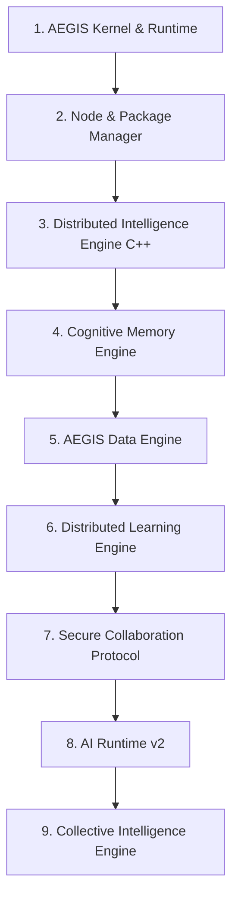

# Demystifying AEGIS: The Sovereign, Privacy-First Collective Intelligence Network

In an era dominated by centralized artificial intelligence giants, a critical question looms: **Can we build a global collective intelligence without sacrificing local sovereignty, data ownership, and individual privacy?**

The answer is **AEGIS**.

AEGIS (Advanced Engine for General Intelligence and Sovereignty) represents a paradigm shift in how AI models are executed, optimized, and connected. It is a production-grade, decentralized platform designed to keep raw data firmly under the user's control while enabling sovereign nodes to securely collaborate, learn, and grow together.

This blog explores the architecture of AEGIS, the critical challenges it solves, its robust production features, and the real-world customers it empowers.

---

## 1. The Core Architecture: A Nine-Phase Blueprint

At its heart, AEGIS is structured as a modular, pluggable monorepo featuring nine foundational core engines that operate in complete synergy:



1. **AEGIS Kernel & Runtime**: The life cycle management foundation orchestrating standard engine registration, IPC channels, and health check triggers.
2. **Node Platform & Package Manager**: The secure verification gateway managing `.aeg` packages containing tools, skills, and agents using digital signatures.
3. **Distributed Intelligence Engine (DIE)**: A high-performance, native C++ daemon managing discovery, P2P socket communication, and worker thread scheduler bounds.
4. **Cognitive Memory Engine**: A multi-tiered semantic context repository handling short-term buffers, semantic searching, index trees, and reflection triggers.
5. **AEGIS Data Engine (ADE)**: A privacy-first pipeline responsible for scanning, validating, and structuring local raw data into training-ready datasets.
6. **AEGIS Distributed Learning Engine (ADLE)**: An automated machine learning manager that orchestrates local training loops, checks gradients, aggregates weights, and publishes tuned LoRA adapters.
7. **AEGIS Secure Collaboration Protocol (ASCIP)**: The negotiation and consensus engine allowing sovereign nodes to delegate sub-tasks, exchange capabilities, and verify inputs using reputation.
8. **AI Runtime v2 (AIR v2)**: The universal execution router supporting local backends (Llama.cpp, Ollama) and cloud engines (OpenAI) regulated by strict policy engines (e.g. Offline or Medical modes).
9. **AEGIS Collective Intelligence Engine (ACIE)**: The cognitive evolution layer that transforms task experiences into distilled, validated, and shareable Knowledge Objects.

---

## 2. The Real Problems AEGIS Solves

Centralized cloud AI has structural limitations that are increasingly hitting walls. AEGIS directly resolves these pain points:

*   **Privacy Violations**: Centralized models require uploading raw customer databases, medical charts, or intellectual property to external clouds. AEGIS operates **entirely locally**, processing data and refining models on the user's machine.
*   **Decentralized Coordination without Data Sharing**: Previously, training collaborative models required consolidating datasets. AEGIS utilizes **Federated & Swarm Learning** to train models across independent nodes. Only model weight updates are transmitted; raw data never leaves the node.
*   **The Cost of Centralized APIs**: Subscribing to external APIs introduces latency, usage restrictions, and exponential scaling costs. AEGIS routes execution through local hardware backends (like Ollama or GGUF files) and utilizes distributed peer execution to split complex tasks.
*   **The "Cold Start" of Agent Performance**: When a new agent or node joins a network, it must learn from scratch. AEGIS shares distilled **Knowledge Objects** and reasoning templates through the Collaboration Engine, allowing a new node to immediately leverage peer insights without access to their training data.

---

## 3. Production Features of the AEGIS Platform

AEGIS is built with enterprise-grade capabilities across 25 key production areas:

| Category | Production Capabilities |
| :--- | :--- |
| **1. Deployment & Lifecycle** | Universal cross-platform installers (Windows, macOS, Linux) with CPU/GPU/CUDA auto-detection. Prod-ready start, stop, restart, crash-recovery, and migration scripts. |
| **2. Distribution & Licensing** | Package Marketplace supporting verified publisher engines, automatic dependency resolution, version pinning, and rollbacks. Edition tiers (Community, Research, Enterprise, Government). |
| **3. UI & Experience** | Polished Desktop and Web Dashboards visualizing trust scores, GPU memory, learning round progress, and knowledge graph links. Rich developer CLI tools. |
| **4. Authentication & Security** | Organization SSO / LDAP mappings, TLS transport tunnels, package/dataset AES encryption, sandboxed engine isolation, and strict resource limiting. |
| **5. Monitoring & Logs** | Real-time monitoring metrics for hardware usage and network latency. Structured rotation, compression, and exporting of security/learning logs. |
| **6. AI & Dataset Operations** | Local GGUF/Ollama inference, cloud provider failovers, streaming tokens with pause/resume controls, context compression, queue scheduling, and dataset versioning. |
| **7. Distributed Learning** | Federated learning dashboards, round scheduling, validation aggregation checks, participant approval lists, and training checkpoint recovery. |
| **8. Collaboration Protocol** | Auto P2P node discovery, encrypted invitations, reputation rating logs, and secure capability/tool exchanges. |
| **9. Collective Intelligence** | Knowledge graphs, experience lineage traces, automated expertise profiling, emergent specializations, and pre-execution workflow recommendations. |
| **10. API Platform** | Comprehensive REST, gRPC, and WebSocket entrypoints for external systems, featuring rate limiting and API key authentication. |

---

## 4. Who are the Real Customers?

AEGIS is designed for sovereign operations across distinct customer verticals:

### 🏥 Healthcare Systems
*   **The Problem**: Medical institutions cannot share patient medical history due to HIPAA regulations, but want to train predictive diagnosis models.
*   **The AEGIS Solution**: Hospitals run AEGIS nodes. They train local diagnostic models, collaborate through secure distributed inference, and share distilled clinical knowledge without exposing a single patient record.

### 🏢 Defense & Government Agencies
*   **The Problem**: Absolute data isolation is required (frequently operating in completely air-gapped environments).
*   **The AEGIS Solution**: Nodes utilize strict `offline` and `always-local` policies. Agencies run private peer-to-peer networks to distribute task execution across air-gapped terminal groups.

### 💻 Enterprise & Financial Institutions
*   **The Problem**: Processing sensitive financial ledgers, code codebases, or proprietary market insights through public cloud models introduces massive legal compliance risks.
*   **The AEGIS Solution**: Companies install AEGIS clusters. The platform acts as a private, high-performance workspace where nodes naturally specialize (e.g. Finance Specialist or Programming Specialist) to serve internal developer teams.

### 🧪 Researchers & Academic Groups
*   **The Problem**: Individual research labs lack the multi-million dollar computing clusters required to train modern AI systems.
*   **The AEGIS Solution**: Labs band together. They register nodes in a shared learning network, combine decentralized GPU capacities via Swarm/Federated learning, and co-develop collective models while retaining intellectual property.

---

## 5. Conclusion: The Cognitive Evolution Loop

Traditional systems perform task execution as a transient process. AEGIS converts **execution into evolution**:

```
Execution ➔ Experience ➔ Reflection ➔ Knowledge ➔ Validation ➔ Collective Memory ➔ Recommendations ➔ Future Execution
```

By closing this loop, the AEGIS network grows more intelligent with every task solved, creating a global, sovereign, and privacy-preserving brain. 

*Visit [github.com/aegisaifoundation/aegis](https://github.com/aegisaifoundation/aegis) to download the SDK and join the collective intelligence revolution.*
