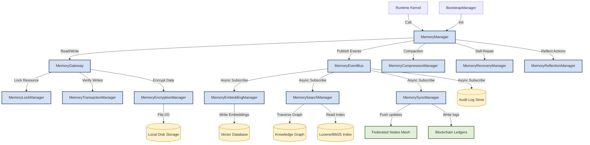
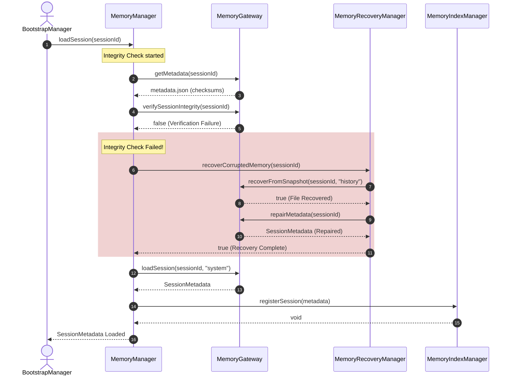
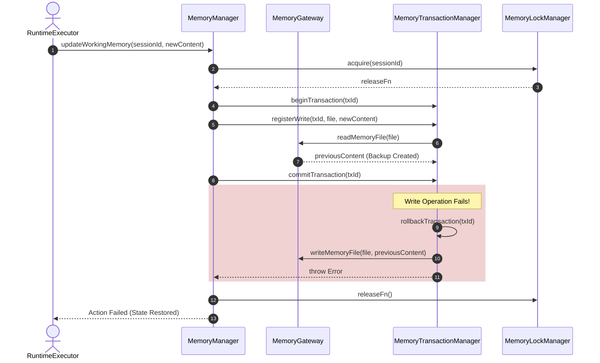
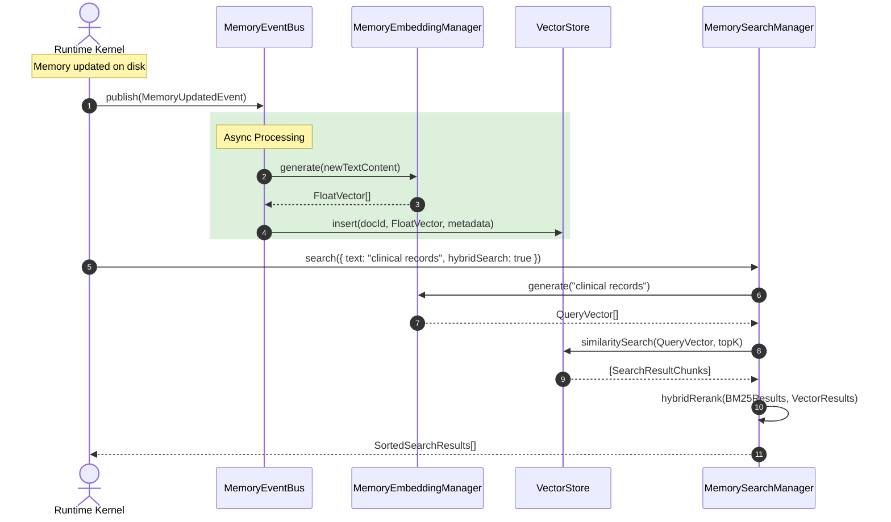
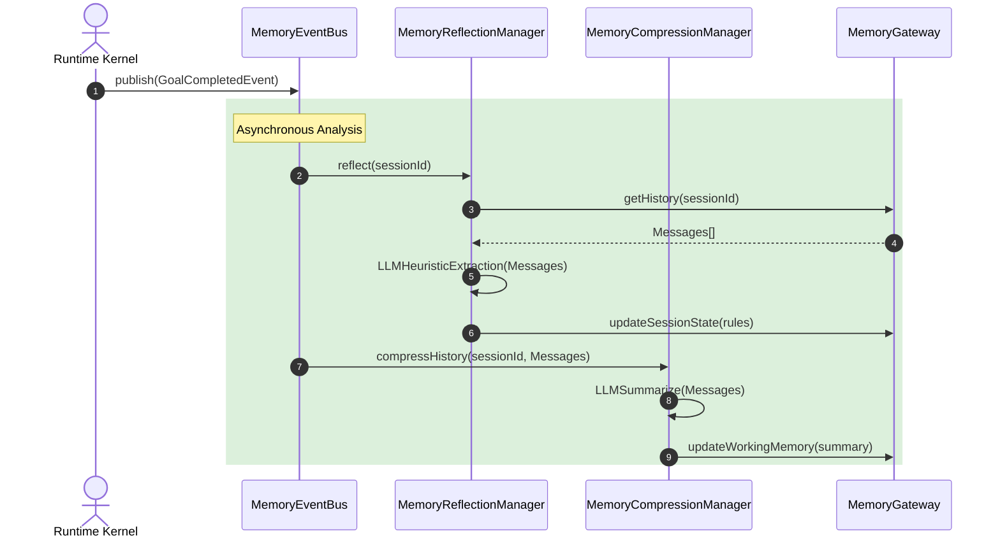

# AEGIS Cognitive Memory Subsystem: Enterprise Architecture Blueprint

This document details the production-grade architectural review, redesign, and extension of the memory subsystem for **AEGIS**, a decentralized, privacy-preserving federated medical AI framework.

---

## 1. Architectural Review of the Existing Memory Subsystem

The current memory subsystem in `aegis-core` is a localized, file-based structured memory system. Below is a detailed evaluation of its characteristics:

### Evaluation Metrics

| Metric | Rating | Analytical Assessment |
| :--- | :--- | :--- |
| **Modularity** | Moderate | Memory is segregated into distinct physical files (e.g. `history.json`, `working-memory.md`). However, processing steps (like Markdown parsing and text compaction) are heavily coupled within the [MemoryManager](file:///c:/aegis/aegis-core/src/memory/MemoryManager.ts) and [MemoryRefiner](file:///c:/aegis/aegis-core/src/memory/refinement/MemoryRefiner.ts) without clean abstraction boundaries. |
| **Scalability** | Low | Reading/writing full JSON/Markdown files to disk on every execution tick introduces severe I/O bottlenecks. There is no indexing layer for fast retrieval in large history files, making it unsuitable for high-throughput concurrency or long-running sessions. |
| **Maintainability**| Moderate | Code responsibilities are clear but inflexible. Adding new storage types (like Vector databases or Graph databases) requires modifying core gateway classes directly rather than registering new adapter plugins. |
| **Reliability** | High | Excellent local reliability features. The presence of transactional buffers, checksum validation, and automated snapshot recovery makes the system highly resilient against single-file write corruption. |
| **Enterprise Readiness** | Low | Lacks role-based access control (RBAC), multi-user encryption, audit logs, remote synchronization, and high-availability database adapters (e.g. SQLite, PostgreSQL, Chroma). |
| **AI-Agent Compatibility** | Moderate | The Markdown projection strategy is highly compatible with LLM context windows. However, the lack of semantic retrieval, task reflection, and episodic experience recall limits the agent's capability to learn from past execution failures. |
| **Fault Tolerance** | High | The rollback transactions and automatic point-in-time recovery from `.snap` files represent robust local fault tolerance. |
| **Performance** | Low | Reading and rewriting complete files synchronously under file locks limits response times. Performance decays exponentially as the conversation history grows. |

### Architectural Strengths
1. **Clean Context Projection**: Translating internal JSON state into simple Markdown lists (`working-memory.md`) is highly efficient for LLM prompt construction.
2. **ACID Properties on File I/O**: The [MemoryTransactionManager](file:///c:/aegis/aegis-core/src/memory/transactions/MemoryTransactionManager.ts) and [MemoryLockManager](file:///c:/aegis/aegis-core/src/memory/locking/MemoryLockManager.ts) prevent race conditions and partial file corruptions during concurrent agent ticks.
3. **Automated Recovery**: Checksum mismatch checks on boot with automatic fallback to snapshots ensure that physical file corruptions are automatically healed.

### Architectural Weaknesses
1. **Synchronous File Rewrites**: The gateway rewrites full documents (e.g., `history.json`) on every message. This creates disk write bottlenecks.
2. **Naive Compaction (Keyword-based)**: Compacting history via static regex matches (e.g., searching for lines starting with "remember") is highly error-prone and misses complex semantic preferences or goals.
3. **No Vector or Graph Subsystem**: The agent is restricted to linear text contexts. It cannot query past messages semantically or traverse clinical relations in `entities.json`.

---

## 2. Improved Cognitive Memory Subsystem Architecture

The evolved architecture transitions AEGIS from a **local file-based state manager** to an **event-driven, multi-tiered Cognitive Memory Platform**. The system preserves backward-compatibility by maintaining the existing Markdown projections while introducing new memory layers:

```
┌────────────────────────────────────────────────────────────────────────────────────────┐
│                              COGNITIVE AGENT RUNTIME KERNEL                            │
└────────────────────────────────────────────────┬───────────────────────────────────────┘
                                                 │
                  ┌──────────────────────────────┴──────────────────────────────┐
                  ▼                                                             ▼
       [Active Context Layer]                                        [Semantic Memory Layer]
 ┌─────────────────────────────────┐                           ┌─────────────────────────────────┐
 │   Working Memory (Short-Term)   │                           │        Vector Memory (RAG)      │
 │   - Goals, Objectives, Tasks    │                           │        - Embedding Cache        │
 │   - Markdown Projections        │                           │        - Semantic Retrieval     │
 └────────────────┬────────────────┘                           └────────────────┬────────────────┘
                  │                                                             │
                  │              ┌──────────────────────────────┐               │
                  ├─────────────►│      MEMORY EVENT BUS        │◄──────────────┤
                  │              └──────────────┬───────────────┘               │
                  ▼                             │                               ▼
       [Episodic Memory Layer]                  │                    [Relational Memory Layer]
 ┌─────────────────────────────────┐            │              ┌─────────────────────────────────┐
 │       Execution History         │            │              │      Clinical Knowledge Graph   │
 │       - Successful Workflows    │◄───────────┼─────────────►│      - Medical entities         │
 │       - Failed reasoning traces │            │              │      - Node relationships       │
 └────────────────┬────────────────┘            │              └────────────────┬────────────────┘
                  │                             ▼                               │
                  │                  ┌─────────────────────┐                    │
                  └─────────────────►│   Reflection Engine │◄───────────────────┘
                                     └──────────┬──────────┘
                                                │
                                                ▼
                                     ┌─────────────────────┐
                                     │   Storage Adapter   │
                                     │ (JSON / SQLite / DB)│
                                     └─────────────────────┘
```

### Strategic Integrations
1. **Autonomous Agents**: Agents plan using the *Active Context Layer* and query the *Episodic Layer* to avoid repeating previously failed tool execution sequences.
2. **Distributed & Cloud Execution**: A synchronization manager pushes encrypted delta updates (using event-driven replication logs) to a decentralized cloud or peer-to-peer network.
3. **Blockchain Integration**: Validated state transitions and cryptographic hashes of clinical memory are written to the validation ledger to maintain auditability.
4. **Federated Learning**: LoRA adapters are associated with specific memory sessions, allowing local clinical records to train models without sharing raw data.

---

## 3. Memory Event Bus Design

The **Memory Event Bus** utilizes an event-driven pub-sub pattern to propagate changes in memory asynchronously to downstream consumers without blocking the primary execution loop of the agent.

```
                  ┌──────────────────────────┐
                  │    Memory Event Bus      │
                  └────────────┬─────────────┘
                               │
       ┌───────────┬───────────┼───────────┬───────────┐
       ▼           ▼           ▼           ▼           ▼
    ┌─────┐    ┌───────┐   ┌───────┐   ┌───────┐   ┌──────┐
    │ UI  │    │Vector │   │ Search│   │ Block │   │Audit │
    │Panel│    │Index  │   │ Engine│   │ Chain │   │ Log  │
    └─────┘    └───────┘   └───────┘   └───────┘   └──────┘
```

### Event Specifications

* **MemoryCreated / MemoryUpdated / MemoryDeleted**: Broadcasts changes to the raw key-value store or Markdown segments.
* **GoalCreated / GoalCompleted**: Fired when objectives change, triggering planning evaluations.
* **TaskCreated / TaskCompleted**: Notifies the UI and analytics engines of execution progress.
* **PreferenceChanged**: Allows the runtime to dynamically adjust model parameters or UI layouts.
* **EntityCreated / EntityUpdated**: Pushed to the Knowledge Graph manager to update relation weights.
* **SessionArchived**: Triggers the snapshot system to build a final archive package.

### Subscriber Implementation

* **UI Dashboard**: Updates task progression boards, active objectives, and session logs in real time.
* **Vector Indexer**: Intercepts `MemoryCreated` and `MemoryUpdated` events, generating vector embeddings in the background.
* **Blockchain Validator**: Computes cryptographic hashes of `GoalCompleted` or `SessionArchived` events and posts them to the decentralized validation ledger.
* **Audit & Monitoring**: Writes cryptographically signed journals of all operations to `analytics/` and `metrics/` directories for clinical audit compliance.

---

## 4. Semantic Retrieval Layer

The Semantic Retrieval Layer enables the agent to search memory conceptually rather than relying on exact word matches.

### Subsystem Components

```
                   ┌──────────────────────────┐
                   │    Raw Text Memory       │
                   └───────────┬──────────────┘
                               ▼
                   ┌──────────────────────────┐
                   │  Embedding Generator     │
                   │ (Local Ollama / GGUF)    │
                   └───────────┬──────────────┘
                               ▼
                   ┌──────────────────────────┐
                   │      Vector Store        │
                   │ (Chroma / HNSWLib / Mem) │
                   └───────────┬──────────────┘
                               ▼
                   ┌──────────────────────────┐
                   │   Similarity Retriever   │
                   │    (Cosine / L2 / IP)    │
                   └───────────┬──────────────┘
                               ▼
                   ┌──────────────────────────┐
                   │        Reranker          │
                   │ (Cross-Encoder / Cohere) │
                   └───────────┬──────────────┘
                               ▼
                   ┌──────────────────────────┐
                   │  Context Injector        │
                   └──────────────────────────┘
```

### Algorithm & Flow
1. **Embedding Generation**: Text is split into semantic paragraphs. Each chunk is passed to the embedding engine to produce a vector representation (e.g., a 768-dimensional array).
2. **Hybrid Search & Filtering**: Combines Keyword Search (BM25) and Semantic Vector Search (Cosine Similarity). Results are pre-filtered based on metadata parameters (such as `sessionId`, `importanceScore`, and tags).
3. **Reranking**: Candidate passages are evaluated by a Cross-Encoder model to calculate precise relevance scores before formatting.
4. **Markdown Projection Integration**: Retrieved context blocks are injected into the LLM prompt under a dynamic `## Retained Semantic Context` header inside `working-memory.md`.

---

## 5. Episodic Memory Subsystem

The **Episodic Memory Subsystem** acts as the agent's autobiography. It stores execution details of past tasks so that the agent can review and learn from experience.

### Database Records
Every episode is saved as a structured execution graph containing:
- **Trigger**: The user prompt or active objective that started the task.
- **Reasoning Chain**: The internal thoughts, actions, and observations made by the planner.
- **Tool Executions**: Inputs, outputs, and success statuses of all tools called.
- **Outcome**: The final answer, generated artifacts, or error status.
- **Metadata**: Importance, time, token cost, and clinical feedback rating.

### Retrieval Strategies
- **Temporal Recall**: Retrieve the sequence of actions taken immediately before or after a specific milestone.
- **Failure-Mode Search**: When the agent encounters a tool error (e.g., FHIR server timeout), it queries the episodic database for historical incidents with similar errors to retrieve successful mitigation workflows.
- **Goal-Directed Recall**: Before planning a complex medical analysis, the agent retrieves the episodic traces of similar completed procedures.

---

## 6. Reflection Memory Subsystem

The **Reflection Engine** runs asynchronously to review recent episodes and update long-term strategies.

### Operational Phases

```
┌──────────────────────┐      ┌──────────────────────┐      ┌──────────────────────┐
│  Collect Episodes    ├─────►│  Analyze Outcome     ├─────►│  Generate Reflection │
│                      │      │  - Identify failures │      │  - What worked/failed│
│                      │      │  - Locate bottlenecks│      │  - Future rules      │
└──────────────────────┘      └──────────────────────┘      └──────────────────────┘
                                                                       │
                                                                       ▼
                                                            ┌──────────────────────┐
                                                            │   Inject Into        │
                                                            │   Session Memory     │
                                                            └──────────────────────┘
```

### Strategy Generation
1. **Trigger**: Executes when a session objective is completed, or when 10 interaction cycles occur.
2. **Analysis**: Evaluates performance metrics, errors, redundant operations, and deviations from the goal.
3. **Consolidation**: Generates structured heuristics, such as:
   * *"When extracting patient data from legacy FHIR endpoints, always fetch in batches of 50 to prevent connection timeouts."*
4. **Heuristic Integration**: These reflections are written to the `reflections/` directory and injected into the `## Preferences` section of `session-memory.md`. This ensures they are loaded into the LLM context for future tasks.

---

## 7. Expanded Relational Knowledge Graph

The simple `entities.json` file is upgraded to a multi-relational Knowledge Graph schema. This graph maps clinical resources, institutional nodes, and models to represent the state of the federated network.

```
       ┌──────────────┐                  ┌─────────────┐
       │ Hospital Node├─────────────────►│ Model (LoRA)│
       └──────┬───────┘                  └──────▲──────┘
              │                                 │
              ▼                                 │
       ┌──────────────┐                  ┌──────┴──────┐
       │ Patient File ├─────────────────►│ Clinical Res│
       └──────────────┘                  └─────────────┘
```

### Entities & Relations
* **Clinical Entities**: `Patient`, `Doctor`, `Hospital`, `Disease`, `Medication`, `Clinical Trial`.
* **System/Federated Entities**: `Federated Node`, `Local Model (LoRA)`, `Research Paper`, `Dataset`, `Medical Edge Device`.
* **Relations**: `DIAGNOSED_WITH`, `PRESCRIBED`, `PARTICIPATES_IN`, `TRAINED_ON`, `VALIDATED_BY`, `LOCATED_AT`.

### Traversal Strategies
* **Breadth-First Search (BFS) / Depth-First Search (DFS)**: Navigates relations to aggregate clinical context (e.g., retrieving all patients diagnosed with a specific condition who were treated with a specific medication at a particular hospital).
* **Semantic Graph Walk**: Scores relationship edges using a dynamic trust metric. The traversal stops if path segments contain nodes with low trust scores, protecting the agent from unreliable federated sources.

---

## 8. Memory Importance Ranking

To manage storage limits and keep context sizes clean, the system assigns a dynamic priority rank to every memory chunk.

### Scoring Model

$$\text{Rank Score} = (\text{Importance} \times \text{Confidence}) \times e^{-\lambda (t - t_0)} \times (1 + \ln(F))$$

Where:
* **$\text{Importance}$** ($0.0 \text{ to } 1.0$): Assessed by the LLM during memory creation (e.g., patient allergies are marked 1.0, while pleasantries are marked 0.1).
* **$\text{Confidence}$** ($0.0 \text{ to } 1.0$): Calculated based on the source verification (e.g., verified clinical EHR records get 1.0, unverified agent outputs get 0.6).
* **$\text{Decay Rate } (\lambda)$**: Dictates how quickly the memory loses priority. High-importance items have a $\lambda$ value close to $0$.
* **$\text{Access Frequency } (F)$**: Increments each time a retrieval matches the memory chunk.
* **$t - t_0$**: Time elapsed since the memory was created or last accessed.

---

## 9. Memory Aging and Lifecycle

The system moves memories through lifecycle states based on their dynamic rank scores to optimize performance and disk footprint.

```
 ┌───────────┐      ┌───────────┐      ┌───────────┐      ┌───────────┐
 │   Active  ├─────►│   Stale   ├─────►│  Archived ├─────►│  Deleted  │
 └─────▲─────┘      └─────┬─────┘      └─────┬─────┘      └───────────┘
       │                  │                  │
       └────Promotion─────┴──────Recovery─────┘
```

### Lifecycle Transitions

1.  **Creation / Promotion**: New facts are marked `ACTIVE`. Old memories that are accessed again are promoted back to `ACTIVE` status, and their decay timers are reset.
2.  **Demotion (Stale)**: When the Importance Rank falls below a set threshold, the item is marked `STALE` and removed from standard context windows.
3.  **Archival**: Periodically, the system compresses `STALE` blocks, creates backup snapshots, and moves the data to the `archives/` directory.
4.  **Deletion / Quarantine**: If a memory hash fails integrity verification, it is moved to quarantine. If a transaction log specifies a deletion policy (like clinical privacy expiry), the file is removed using secure deletion algorithms.

---

## 10. Memory Search API

The system provides a query interface to search across all memory subsystems.

```typescript
export interface SearchQuery {
  text?: string;
  vector?: number[];
  types: ('fact' | 'goal' | 'task' | 'conversation' | 'entity' | 'preference' | 'reflection' | 'episode')[];
  filters?: {
    tags?: string[];
    importanceThreshold?: number;
    timeRange?: { start: Date; end: Date };
    entityTypes?: string[];
    confidenceThreshold?: number;
  };
  options?: {
    limit?: number;
    hybridSearch?: boolean;
    useReranker?: boolean;
  };
}

export interface SearchResult {
  score: number;
  type: string;
  sourceId: string;
  content: any;
  metadata: Record<string, any>;
}

export interface IMemorySearchManager {
  search(query: SearchQuery): Promise<SearchResult[]>;
}
```

---

## 11. Versioned Memory Subsystem

The Versioned Memory Subsystem implements Git-like version control for agent state configurations, supporting branching, diff operations, and merge conflicts resolution.

```
       [Session Master] ────────────► Commit C1 ────────────► Commit C2 (Active)
              │
         [Branch Out]
              ▼
       [Workflow Branch] ──────────► Commit B1 ────────────► Merge Attempt (Conflict Check)
```

### Operations
* **Commit**: Creates a snapshot of all active memory files. It assigns a commit hash and adds a record to the session’s commit history database.
* **Undo / Restore**: Resets the active session files to the state of a specified commit hash.
* **Branch**: Spawns a virtual memory environment where the agent can test workflows without affecting the primary session state.
* **Merge**: Incorporates the changes from a branch back into the master timeline. The system uses a conflict resolver to merge changes, prioritizing human-updated clinical fields over automated agent modifications.

---

## 12. AI-Based Memory Compression

Instead of relying on regex filters, the system uses an asynchronous LLM task to compress long histories into structured, dense summaries.

### Summary Schema
```json
{
  "goals": ["Assess patient lung scans for abnormalities"],
  "facts": ["Patient exhibits a persistent cough for 3 weeks"],
  "preferences": ["Preferred radiology model: Local-Gemma4-Q8"],
  "decisions": ["Scheduled diagnostic CT scan of chest"],
  "pendingTasks": ["Verify DICOM metadata integrity"],
  "openQuestions": ["Has the patient had similar symptoms in the past?"],
  "risks": ["Potential artifacting in lower lung lobes"],
  "futureActions": ["Re-run pipeline once validation node signs update"]
}
```

This summary schema is updated periodically, keeping the context size small while preserving critical reasoning state.

---

## 13. Redesigned Enterprise Folder Structure

The folder layout is redesigned to support the new cognitive memory subsystems:

```text
memory/
├── sessions/             # Active session databases (SQLite / JSON)
├── snapshots/            # Automated backups (.snap) and transaction rollback logs
├── indexes/              # Session registries, search catalogs, and bloom filters
├── embeddings/           # Local vector databases (ChromaDB / HNSW indices)
├── semantic/             # Semantic retrieval indexes and chunk metadata
├── graph/                # Unified clinical knowledge graph database files
├── reflections/          # Generated agent reflections and strategy recommendations
├── episodic/             # Auto-saved workflow traces and reasoning journals
├── archives/             # Long-term cold storage archives (Gzipped JSON files)
├── analytics/            # Performance and telemetry reports
├── metrics/              # System utilization logs (disk usage, token counts)
├── cache/                # Temporary execution buffers and embedding caches
├── search/               # Search indexes (BM25 and fuzzy search indices)
├── migrations/           # Database schema migration scripts and logs
├── projections/          # Generated Markdown files for LLM ingestion
└── plugins/              # Dynamic memory adapter binaries and libraries
```

### Folder Justification
- `embeddings/` & `semantic/` isolate vector operations from file-based session states.
- `reflections/` & `episodic/` separate long-term strategy optimization and experience logs from the active working context.
- `graph/` provides a dedicated space for clinical entity relationships.
- `analytics/` & `metrics/` support monitoring and audits without cluttering active runtime folders.

---

## 14. Additional Managers Specifications

To orchestrate these subsystems, 11 new managers are introduced to the core:

```
                          ┌──────────────────────────┐
                          │   System Boot Runtime    │
                          └────────────┬─────────────┘
                                       │
                         ┌─────────────┴─────────────┐
                         ▼                           ▼
            ┌──────────────────────────┐┌──────────────────────────┐
            │   MemoryEventBus         ││  MemoryEncryptionManager │
            └────────────┬─────────────┘└────────────┬─────────────┘
                         │                           │
                         ▼                           ▼
            ┌──────────────────────────┐┌──────────────────────────┐
            │  MemoryEmbeddingManager  ││    MemorySearchManager   │
            └────────────┬─────────────┘└────────────┬─────────────┘
                         │                           │
                         ▼                           ▼
            ┌──────────────────────────┐┌──────────────────────────┐
            │   MemoryRankingManager   ││ MemoryCompressionManager │
            └────────────┬─────────────┘└────────────┬─────────────┘
                         │                           │
                         ▼                           ▼
            ┌──────────────────────────┐┌──────────────────────────┐
            │  MemoryReflectionManager ││    MemoryConflictResolver│
            └────────────┬─────────────┘└────────────┬─────────────┘
                         │                           │
                         ▼                           ▼
            ┌──────────────────────────┐┌──────────────────────────┐
            │   MemoryAnalyticsManager ││     MemorySyncManager    │
            └──────────────────────────┘└────────────┬─────────────┘
                                                     │
                                                     ▼
                                        ┌──────────────────────────┐
                                        │  MemorySnapshotScheduler │
                                        └──────────────────────────┘
```

---

### [NEW] MemoryEventBus
* **Responsibilities**: Orchestrates the pub-sub pipeline. It registers listeners, queues incoming events, and dispatches them asynchronously using thread-pool executors.
* **Lifecycle**: Instantiated on system boot. It teardowns during kernel shutdown after flushing queued events.
* **Public APIs**:
  * `publish(event: MemoryEvent): void`
  * `subscribe(topic: string, handler: (e: MemoryEvent) => void): string`
  * `unsubscribe(subscriptionId: string): void`
* **Interactions**: Receives events from `MemoryGateway` and `MemoryManager`, and notifies indexers, logs, and external audit endpoints.
* **Failure Handling**: Utilizes an in-memory Dead-Letter Queue (DLQ) to log and retry events that failed to process.

---

### [NEW] MemoryEmbeddingManager
* **Responsibilities**: Interfaces with embedding models to convert text passages into high-dimensional vectors.
* **Lifecycle**: Starts with the runtime kernel, loading model settings. It flushes caches on exit.
* **Public APIs**:
  * `generate(text: string): Promise<number[]>`
  * `generateBatch(texts: string[]): Promise<number[][]>`
  * `getDimensionSize(): number`
* **Interactions**: Called by the Semantic Retriever when indexing or searching memories.
* **Failure Handling**: Falls back to a local model (using Ollama/GGUF) if cloud API endpoints are unavailable or timeout.

---

### [NEW] MemorySearchManager
* **Responsibilities**: Executes search queries across vector databases, keyword indexes, and relational graph files.
* **Lifecycle**: Initialized on boot. It re-indexes data directories in the background.
* **Public APIs**:
  * `search(query: SearchQuery): Promise<SearchResult[]>`
  * `indexDocument(docId: string, content: string, meta: Record<string, any>): Promise<void>`
  * `evictDocument(docId: string): Promise<void>`
* **Interactions**: Interacts with the Vector Store, Knowledge Graph, and BM25 indexers.
* **Failure Handling**: If the vector index is corrupt, it falls back to keyword-based fuzzy search.

---

### [NEW] MemoryRankingManager
* **Responsibilities**: Calculates priority rankings, update frequencies, and decay curves for memory nodes.
* **Lifecycle**: Initialized with `MemoryManager`. It runs optimization sweeps in the background.
* **Public APIs**:
  * `rank(sessionId: string, items: MemoryItem[]): Promise<MemoryItem[]>`
  * `recordAccess(itemId: string): Promise<void>`
  * `adjustDecayRate(itemId: string, newLambda: number): Promise<void>`
* **Interactions**: Monitors access logs to update ranking scores.
* **Failure Handling**: Defaults to timestamp sorting if scoring metadata is corrupted.

---

### [NEW] MemoryReflectionManager
* **Responsibilities**: Asynchronously reviews recent interaction history to generate strategic rules and preferences.
* **Lifecycle**: Triggered by event thresholds (e.g., goal completion). It runs in low-priority background workers.
* **Public APIs**:
  * `reflect(sessionId: string): Promise<ReflectionRule[]>`
  * `getReflectionHistory(sessionId: string): Promise<ReflectionLog[]>`
* **Interactions**: Reads history logs via `MemoryGateway` and writes recommendations back to session preferences.
* **Failure Handling**: If the LLM call fails, it retries after a backoff period.

---

### [NEW] MemoryCompressionManager
* **Responsibilities**: Manages the compaction pipeline, calling LLMs to condense old conversation history into structured summaries.
* **Lifecycle**: Executed during memory compaction routines.
* **Public APIs**:
  * `compressHistory(sessionId: string, messages: Message[]): Promise<CompressedState>`
  * `estimateTokenSavings(messages: Message[]): number`
* **Interactions**: Called by `MemoryManager` to trim active context sizes.
* **Failure Handling**: Falls back to simple truncation if compression models fail or are overloaded.

---

### [NEW] MemoryAnalyticsManager
* **Responsibilities**: Computes usage statistics, monitoring disk size, token counts, and hit/miss search rates.
* **Lifecycle**: Runs continuously, flushing reports to `metrics/` at regular intervals.
* **Public APIs**:
  * `logMetrics(sessionId: string, metrics: ActivityMetrics): void`
  * `getSessionReport(sessionId: string): Promise<SessionReport>`
* **Interactions**: Receives tracking data from the search and retrieval layers.
* **Failure Handling**: Logs warning events to standard error streams without blocking memory operations.

---

### [NEW] MemoryEncryptionManager
* **Responsibilities**: Encrypts and decrypts files at rest, managing key stores and signing session packages.
* **Lifecycle**: Initialized immediately on kernel boot.
* **Public APIs**:
  * `encrypt(payload: Buffer, keyId: string): Buffer`
  * `decrypt(ciphertext: Buffer, keyId: string): Buffer`
  * `sign(payload: Buffer): Buffer`
  * `verify(payload: Buffer, signature: Buffer): boolean`
* **Interactions**: Wraps file read/write operations inside `MemoryGateway`.
* **Failure Handling**: Halts the boot sequence if cryptographic keys are invalid or missing.

---

### [NEW] MemoryConflictResolver
* **Responsibilities**: Resolves state conflicts when merging memory branches or syncing remote sessions.
* **Lifecycle**: Called on demand during sync or merge operations.
* **Public APIs**:
  * `resolve(localState: SessionState, remoteState: SessionState): MergeResult`
  * `registerResolutionRule(type: string, strategy: MergeStrategy): void`
* **Interactions**: Used by the sync and versioning layers.
* **Failure Handling**: Marks conflicting entries for manual clinical review if automated rules cannot resolve them.

---

### [NEW] MemorySyncManager
* **Responsibilities**: Propagates local memory events to remote federated nodes and cloud providers.
* **Lifecycle**: Managed by the network stack, running background sync tasks.
* **Public APIs**:
  * `synchronize(sessionId: string): Promise<SyncStatus>`
  * `pushDelta(sessionId: string, delta: MemoryDelta): Promise<void>`
  * `pullDelta(sessionId: string): Promise<MemoryDelta>`
* **Interactions**: Subscribes to the Event Bus and writes incoming changes to the Storage Layer.
* **Failure Handling**: Retries failed sync updates using exponential backoff.

---

### [NEW] MemorySnapshotScheduler
* **Responsibilities**: Automates snapshot creation based on time intervals or event checkpoints.
* **Lifecycle**: Runs a periodic loop as long as the system is active.
* **Public APIs**:
  * `scheduleCheckpoint(sessionId: string): void`
  * `triggerManualSnapshot(sessionId: string): Promise<string>`
* **Interactions**: Commands `MemoryManager` to create snapshots.
* **Failure Handling**: Defer snapshots if disk space is low or write locks are active.

---

## 15. Updated Component Architecture Diagram

The component diagram shows how runtime systems, storage backends, and security managers interact:



---

## 16. Operations Sequence Diagrams

---

### A. Session Initialization & Recovery Boot

This sequence shows how the system loads a session, verifies its integrity, and runs self-repair if corruption is detected:



---

### B. Transactional Memory Update with Rollback

This sequence demonstrates write operations under transactional scope, showing rollback triggers when errors occur:



---

### C. Asynchronous Semantic Memory Extraction & Retrieval

This sequence outlines how memories are vectorized asynchronously and retrieved using semantic search:



---

### D. Automated Task Reflection & Compression

This sequence shows the background reflection loop triggered after completing an objective:



---

## 17. Database & File Schemas

Below are the complete TypeScript interfaces for the redesigned session files.

### A. Redesigned Metadata Schema (`metadata.json`)

```typescript
export interface KeyValidationSignature {
  publicKey: string;
  signature: string;
  timestamp: string;
}

export interface SecurityPolicy {
  encryptionAlgorithm: 'AES-GCM-256' | 'ChaCha20-Poly1305';
  keyId: string;
  requiresMfa: boolean;
  tamperVerification: KeyValidationSignature;
}

export interface AdvancedMemoryQuotas {
  maxSessions: number;
  maxHistorySize: number;       // in bytes
  maxWorkingMemorySize: number;  // in words
  maxSessionMemorySize: number;  // in words
  maxSnapshots: number;
  maxVectorChunks: number;
  maxGraphNodes: number;
}

export interface EnterpriseSessionMetadata {
  sessionId: string;
  displayName: string;
  description: string;
  createdAt: string;
  updatedAt: string;
  lastAccessedAt: string;
  lastMountedAt: string;
  memoryVersion: string;
  lifecycleState: 'ACTIVE' | 'STALE' | 'ARCHIVED' | 'EXPIRED' | 'CORRUPTED' | 'LOCKED' | 'DELETED';
  tags: string[];
  
  // Integrity Checks
  checksums: {
    history: string;
    sessionMemory: string;
    workingMemory: string;
    entities: string;
    episodic: string;
  };
  corruptionScore: number;
  lastValidatedAt: string;
  
  // Security
  security: SecurityPolicy;
  quotas: AdvancedMemoryQuotas;
}
```

---

### B. Structured Session State Schema (`session-state.json`)

```typescript
export interface SubTask {
  id: string;
  description: string;
  status: 'PENDING' | 'RUNNING' | 'COMPLETED' | 'FAILED';
  assignedAgent?: string;
  completedAt?: string;
}

export interface GoalObjective {
  id: string;
  title: string;
  description: string;
  importance: number; // 0.0 to 1.0
  status: 'ACTIVE' | 'BLOCKED' | 'COMPLETED' | 'ABANDONED';
  subtasks: SubTask[];
}

export interface ExecutionContextVariable {
  key: string;
  value: any;
  updatedAt: string;
  sourceAgentId: string;
}

export interface EnterpriseSessionState {
  sessionId: string;
  status: 'ACTIVE' | 'INACTIVE' | 'ARCHIVED' | 'DELETED';
  activeGoals: GoalObjective[];
  variables: Record<string, ExecutionContextVariable>;
  preferences: Record<string, any>;
  stableFacts: string[];
  checkpointVersion: number;
}
```

---

### C. Clinical Knowledge Graph Schema (`entities.json`)

```typescript
export interface GraphProvenance {
  sourceId: string; // Message ID or File path
  agentId: string;
  confidence: number; // 0.0 to 1.0
  verifiedAt: string;
}

export interface ClinicalNode {
  id: string;
  type: 'Patient' | 'Doctor' | 'Hospital' | 'Disease' | 'Medication' | 'FederatedNode' | 'Model';
  name: string;
  properties: Record<string, any>; // Medical attributes
  provenance: GraphProvenance;
}

export interface SemanticEdge {
  sourceId: string;
  targetId: string;
  type: 'DIAGNOSED_WITH' | 'PRESCRIBED' | 'PARTICIPATES_IN' | 'VALIDATED_BY' | 'BELONGS_TO';
  weight: number; // Relationship strength
  provenance: GraphProvenance;
}

export interface AdvancedKnowledgeGraph {
  nodes: ClinicalNode[];
  edges: SemanticEdge[];
  lastCalculatedEntropy: number;
}
```

---

### D. Episodic Memory Schema (`episodic/`)

```typescript
export interface ToolTrace {
  toolName: string;
  inputArguments: string;
  outputPayload: string;
  executionStatus: 'SUCCESS' | 'FAILURE';
  durationMs: number;
}

export interface EpisodeRecord {
  episodeId: string;
  sessionId: string;
  timestamp: string;
  triggerPrompt: string;
  reasoningSteps: string[];
  toolCalls: ToolTrace[];
  outcomeSummary: string;
  overallSuccess: boolean;
  importanceRating: number; // 0.0 to 1.0
  tokensUsed: number;
}
```

---

### E. Reflection Record Schema (`reflections/`)

```typescript
export interface ReflectionRecord {
  reflectionId: string;
  sessionId: string;
  timestamp: string;
  sourceEpisodeRange: { startEpisodeId: string; endEpisodeId: string };
  whatWorked: string[];
  whatFailed: string[];
  heuristicsGenerated: string[];
  futureRules: string[];
  impactScore: number; // 0.0 to 1.0 (relevance rating)
}
```

---

## 18. Redesigned TypeScript Source Architecture

The directory structure inside [aegis-core/src/memory/](file:///c:/aegis/aegis-core/src/memory/) is restructured into modular domains:

```text
aegis-core/src/memory/
├── index.ts                     # Main module exports
├── MemoryManager.ts             # Orchestrates the subsystem
├── MemoryGateway.ts             # Low-level physical file access DAO
├── MemoryContext.ts             # Context passed during initialization
├── contracts/                   # Data validation classes
│   ├── MemoryContract.ts
│   ├── MetadataContract.ts
│   └── SecurityContract.ts
├── interfaces/                  # Interface and types declarations
│   ├── IMemoryManager.ts
│   ├── IMemoryGateway.ts
│   └── MemoryTypes.ts
├── eventbus/                    # Asynchronous Event Bus subsystem
│   ├── MemoryEventBus.ts
│   ├── MemoryEvent.ts
│   └── handlers/
│       ├── EmbeddingHandler.ts  # Generates vectors when memory changes
│       └── AuditLogger.ts       # Logs events for auditing
├── search/                      # Retrieval & Search managers
│   ├── MemorySearchManager.ts
│   ├── VectorSearchProvider.ts  # Local vector database adapter
│   └── GraphTraversalEngine.ts  # Knowledge graph query manager
├── embedding/                   # Embeddings services
│   ├── MemoryEmbeddingManager.ts
│   └── providers/
│       ├── OllamaEmbeddingProvider.ts
│       └── LocalGGUFProvider.ts
├── analytics/                   # Monitoring and metrics tools
│   └── MemoryAnalyticsManager.ts
├── locking/                     # Mutex locks
│   └── MemoryLockManager.ts
├── transactions/                # ACID transactional writes
│   └── MemoryTransactionManager.ts
├── recovery/                    # Self-repair logic
│   └── MemoryRecoveryManager.ts
└── refinement/                  # Summarization & compaction
    ├── MemoryRefiner.ts
    ├── MemoryCompressionManager.ts
    └── MemoryRankingManager.ts
```

---

## 19. Security, Cryptography & Compliance

As a medical system, AEGIS implements strict security controls to protect patient health records:

### Encryption at Rest & Flight
* **Payload Encryption**: All JSON states are encrypted before writing using **AES-GCM-256**. The encryption keys are managed by a local Key Management Service (KMS).
* **Encrypted Snapshots**: Snapshots in the `snapshots/` folder are compressed and signed using public-key cryptography (**ECDSA-P256**), preventing unauthorized file modifications.

### Access Control & Governance
* **Attribution Checks**: Reads and writes must include a verified `SourceAttribution` block containing a valid digital signature. Visitors without proper credentials are restricted to read-only access.
* **Tamper Verification**: On load, `metadata.json` checks the signatures of the session files. If verification fails, the session is isolated and flagged as `CORRUPTED`.

### Clinical Auditing & Privacy
* **Immutable Audit Trail**: Log records are signed using cryptographic signatures and written to `analytics/` directories. This generates a verifiable ledger of patient file access.
* **Secure Erasure**: The system conforms to military sanitization standards (such as DoD 5220.22-M) by overwriting deleted session files with random patterns before removal. This ensures patient data cannot be recovered.

---

## 20. System Scalability Analysis

The redesign scales efficiently across the federated medical ecosystem:

```
                  ┌──────────────────────────────┐
                  │      Cloud Sync Provider     │
                  └──────────────▲───────────────┘
                                 │ Sync Deltas
                  ┌──────────────┴───────────────┐
                  │      MemorySyncManager       │
                  └──────────────▲───────────────┘
                                 │ Publish / Subscribe
                  ┌──────────────┴───────────────┐
                  │       MemoryEventBus         │
                  └──────────────▲───────────────┘
                                 │ Queue Tasks
                  ┌──────────────┴───────────────┐
                  │     Worker Pools (CPU/IO)    │
                  └──────────────────────────────┘
```

* **Millions of Sessions**: Active sessions use light file-based metadata, while inactive sessions are compressed and moved to cold storage archives.
* **CPU and I/O Isolation**: The event-driven architecture processes slow operations (like generating embeddings and clinical graph walks) on background thread pools, keeping the main agent execution loop fast.
* **Decentralized Synchronization**: Instead of transmitting full files, the system pushes compact, encrypted delta updates (transaction diff logs) over the network. This minimizes network overhead for edge devices and rural clinic connections.
* **Federated Learning**: LoRA weights are updated using local, private memory contexts, enabling models to train collaboratively without transferring sensitive data.

---

## 21. System Migration Strategy

This migration strategy upgrades existing AEGIS deployments to the new cognitive memory system without data loss.

### Phase 1: Directory Setup
* Bootstrapping the upgraded kernel automatically creates the new directory structures (such as `embeddings/`, `graph/`, and `reflections/`) inside the existing `memory/` workspace.

### Phase 2: Metadata Upgrade
* The [MemoryMigrationManager](file:///c:/aegis/aegis-core/src/memory/migration/MemoryMigrationManager.ts) reads existing `metadata.json` files and appends the new properties (`security`, `quotas`, and `corruptionScore`), setting default validation keys.

### Phase 3: Graph and State Migration
* Existing `entities.json` files are parsed and rewritten into the new nodes/edges relational schema.
* Plain text variables from `session-state.json` are structured into objective and subtask formats.

### Phase 4: Background Vectorization
* An asynchronous task scans the existing message history, generates semantic embeddings, and populates the local vector database. This processes the legacy data without blocking active clinical workflows.

---

## 22. Implementation Roadmap

```
Phase 1: Boot & Security (Week 1-2)
├─ Implement MemoryEncryptionManager & AES-GCM file wrappers
└─ Upgrade Bootstrapper to initialize directory structures

Phase 2: Event-Driven Infrastructure (Week 3-4)
├─ Implement MemoryEventBus pub-sub routing
└─ Integrate MemoryTransactionManager hooks with the event bus

Phase 3: Semantic & Graph Subsystems (Week 5-6)
├─ Build MemoryEmbeddingManager using local Ollama model adapters
└─ Redesign knowledge graph structures and node relation models

Phase 4: Optimization & Refinements (Week 7-8)
├─ Implement MemoryReflectionManager and task analysis loops
└─ Build MemoryRankingManager (importance scoring and aging decays)
```
