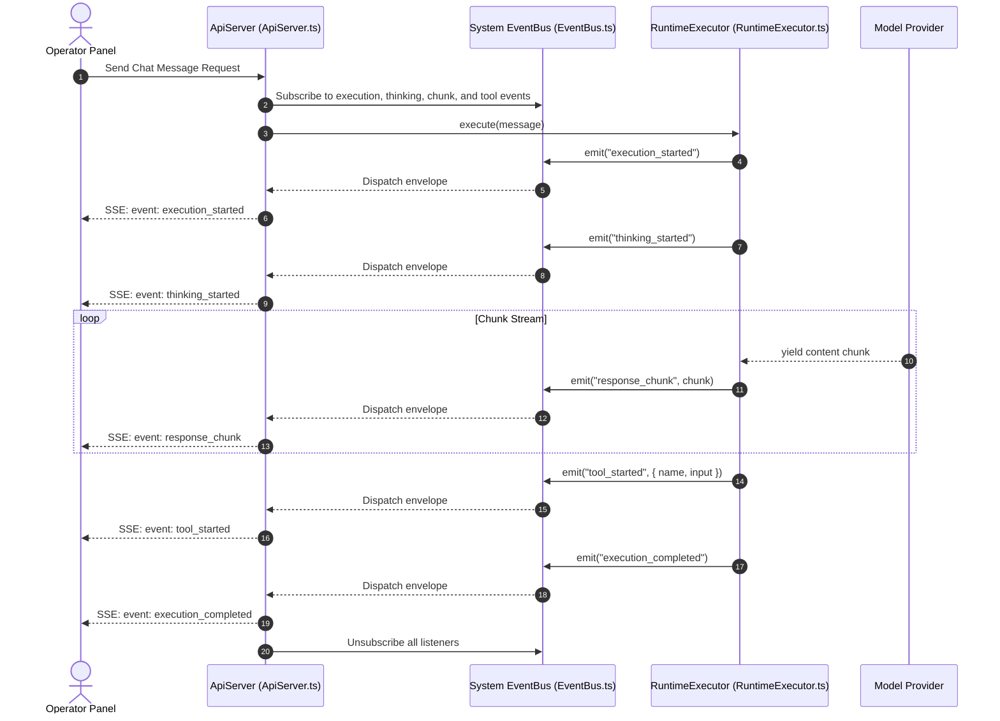
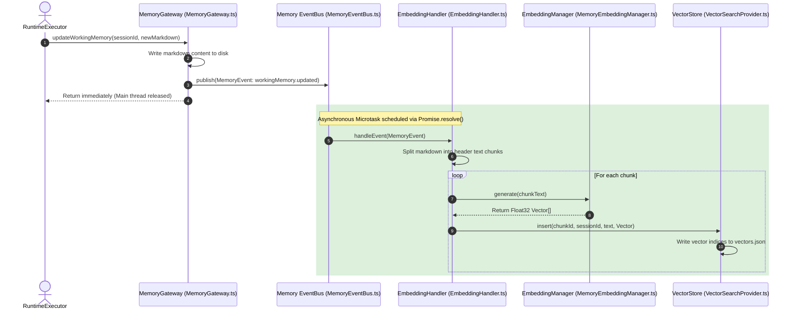

# AEGIS Monorepo Event Bus: Architectural & Implementation Deep-Dive

---

## 1. Overview of the Event Bus Architecture

AEGIS employs two decoupled event bus systems to coordinate the system execution lifecycle and data storage modifications. This separation keeps the primary AI execution loop fast, ensures modularity, and facilitates asynchronous background processing without resource contention:

```
┌────────────────────────────────────────────────────────────────────────┐
│                          AEGIS RUNTIME KERNEL                          │
└──────────────┬──────────────────────────────────────────┬──────────────┘
               │                                          │
               ▼                                          ▼
     [System Runtime EventBus]                 [Memory Subsystem EventBus]
   - EventBus.ts (Synchronous)                 - MemoryEventBus.ts (Asynchronous)
   - Exposes: execution_started,               - Exposes: workingMemory.updated,
     thinking_started, response_chunk,           sessionMemory.updated, entity.updated,
     tool_started, command_executed, etc.        history.appended, snapshot.created, etc.
               │                                          │
        ┌──────┴──────┐                            ┌──────┴──────┐
        ▼             ▼                            ▼             ▼
  [API Server]  [Terminal UI]             [EmbeddingHandler] [ReflectionHandler]
  - streams SSE - renders logs            - Nomical vectors  - Extracts rules
    responses     to operator               generation         from history
```

1.  **System Runtime EventBus (`EventBus.ts`)**: Coordinates kernel runtime lifecycle events, slash commands, dynamic capability configurations, and execution turns. It executes listeners synchronously to ensure immediate UI and API state updates.
2.  **Memory Subsystem EventBus (`MemoryEventBus.ts`)**: Propagates data modification events. It executes listeners asynchronously using microtask scheduling to prevent disk operations (like generating vector embeddings or compiling graph traversals) from blocking the reasoning loops.

---

## 2. System Runtime EventBus (`aegis-runtime`)

The Runtime EventBus is implemented in `@aegis/runtime` and shared across monorepo packages to orchestrate system state.

### 2.1. Event Envelope Schema (`EventPayloads.ts`)
All emitted events are wrapped inside an `EventEnvelope` structure:
```typescript
export interface EventEnvelope<T = any> {
  event: string;      // The event name (topic)
  timestamp: number;  // Epoch millisecond timestamp
  source: string;     // The emitting subsystem (e.g. 'runtime-executor')
  payload: T;         // Associated data payload
}
```

### 2.2. Event Registry (`EventRegistry.ts`)
On startup, standardized events are registered inside the `EventRegistry` database containing descriptive metadata and validation hook callbacks:
*   `runtime_started` — Fired when the microkernel bootstraps successfully.
*   `runtime_shutdown` — Fired when shutdown is requested.
*   `provider_initialized` / `provider_failed` — Fired during LLM connection tests.
*   `plugin_loaded` / `plugin_failed` — Fired when plugins are activated/deactivated.
*   `skill_executed` / `skill_failed` — Fired during skill execution.
*   `message_received` — Fired when a message is added to the active conversation history.
*   `execution_started` / `execution_completed` — Fired around execution turns.
*   `command_executed` / `command_failed` — Fired around slash command runs.
*   `memory.updated` / `memory.deleted` — Fired on cache updates.

---

### 2.3. EventBus Engine Implementation (`EventBus.ts`)
The `EventBus` class registers listeners using unique Map references:
```typescript
export type EventListener<T = any> = (envelope: EventEnvelope<T>) => void | Promise<void>;

export class EventBus {
  private listeners = new Map<string, Set<EventListener>>();

  public on<T = any>(event: string, listener: EventListener<T>): void {
    if (!this.listeners.has(event)) {
      this.listeners.set(event, new Set());
    }
    this.listeners.get(event)!.add(listener);
  }

  public off<T = any>(event: string, listener: EventListener<T>): void {
    const set = this.listeners.get(event);
    if (set) {
      set.delete(listener);
      if (set.size === 0) {
        this.listeners.delete(event);
      }
    }
  }

  public once<T = any>(event: string, listener: EventListener<T>): void {
    const wrapper: EventListener<T> = (envelope: EventEnvelope<T>) => {
      this.off(event, wrapper);
      return listener(envelope);
    };
    this.on(event, wrapper);
  }

  public emit<T = any>(event: string, payloadOrEnvelope?: T | EventEnvelope<T>, source?: string): void {
    let envelope: EventEnvelope<T>;

    if (payloadOrEnvelope && typeof payloadOrEnvelope === 'object' && 'event' in payloadOrEnvelope && 'timestamp' in payloadOrEnvelope && 'source' in payloadOrEnvelope && 'payload' in payloadOrEnvelope) {
      envelope = payloadOrEnvelope as EventEnvelope<T>;
    } else {
      envelope = {
        event,
        timestamp: Date.now(),
        source: source || 'system',
        payload: payloadOrEnvelope as T,
      };
    }

    const set = this.listeners.get(event);
    if (set) {
      const targets = Array.from(set);
      for (const listener of targets) {
        try {
          const result = listener(envelope);
          if (result instanceof Promise) {
            result.catch(err => {
              console.error(`[EventBus] Async listener error on event '${event}':`, err);
            });
          }
        } catch (err) {
          console.error(`[EventBus] Sync listener error on event '${event}':`, err);
        }
      }
    }
  }
}
```

---

## 3. Cognitive Memory EventBus (`aegis-core/src/memory/eventbus`)

The memory subsystem implements a dedicated `MemoryEventBus` to handle storage modifications.

### 3.1. Memory Event Schema (`MemoryEvent.ts`)
```typescript
export interface MemoryEvent<T = any> {
  eventId: string;     // Unique UUID event identifier
  topic: string;       // The database topic (e.g. 'workingMemory.updated')
  timestamp: string;   // ISO string timestamp
  sessionId: string;   // Active session identifier context
  actor: string;       // Issuer authorization name ('user', 'system')
  payload: T;          // Associated payload
}
```

---

### 3.2. Asynchronous Namespace Routing (`MemoryEventBus.ts`)
The `MemoryEventBus` class supports namespace routing. Listeners can subscribe to specific topics, global wildcards (`*`), or namespace wildcards (`session.*` matches `session.created` and `session.deleted`):

```typescript
export type MemoryEventHandler = (event: MemoryEvent) => void | Promise<void>;

export class MemoryEventBus {
  private static instance = new MemoryEventBus();
  private subscribers = new Map<string, Map<string, MemoryEventHandler>>();

  public static getInstance(): MemoryEventBus {
    return this.instance;
  }

  public subscribe(topic: string, handler: MemoryEventHandler): string {
    const subId = `sub_${Date.now()}_${Math.random().toString(36).substring(2, 11)}`;
    if (!this.subscribers.has(topic)) {
      this.subscribers.set(topic, new Map());
    }
    this.subscribers.get(topic)!.set(subId, handler);
    return subId;
  }

  public unsubscribe(subscriptionId: string): void {
    for (const [topic, handlersMap] of this.subscribers.entries()) {
      if (handlersMap.has(subscriptionId)) {
        handlersMap.delete(subscriptionId);
        if (handlersMap.size === 0) {
          this.subscribers.delete(topic);
        }
        break;
      }
    }
  }

  public publish(event: MemoryEvent): void {
    // Exact match topic execution
    this.dispatch(event.topic, event);

    // Global wildcard match topic execution
    this.dispatch('*', event);

    // Namespace wildcard match (e.g. 'session.*' matches 'session.created')
    if (event.topic.includes('.')) {
      const parts = event.topic.split('.');
      if (parts.length > 0) {
        this.dispatch(`${parts[0]}.*`, event);
      }
    }
  }

  private dispatch(topicPattern: string, event: MemoryEvent): void {
    const handlersMap = this.subscribers.get(topicPattern);
    if (handlersMap) {
      for (const handler of handlersMap.values()) {
        // Schedule execution asynchronously via microtask queue to avoid blocking
        Promise.resolve().then(async () => {
          try {
            await handler(event);
          } catch (err) {
            console.error(`[MemoryEventBus] Error in handler for topic ${topicPattern}:`, err);
          }
        });
      }
    }
  }
}
```

---

### 3.3. Memory Event Handlers
The EventBus routes memory events to three primary background handlers:

#### A. EmbeddingHandler (`EmbeddingHandler.ts`)
Subscribes to: `workingMemory.updated`, `sessionMemory.updated`
1. Receives modified Markdown contents.
2. Chunk-splits the text dynamically based on Markdown header tags (`#` and `##`).
3. Calls `MemoryEmbeddingManager` to generate Float32 vectors.
4. Updates the local vector database (`vectors.json`).

#### B. ReflectionHandler (`ReflectionHandler.ts`)
Subscribes to: `session.archived`
1. Triggered when a session is completed or archived.
2. Extracts failed tool calls (errors, timeouts) and successful completions.
3. Generates future execution guidelines.
4. Appends them to the session state preferences.

#### C. AuditLogger (`AuditLogger.ts`)
Subscribes to: `*`
1. Intercepts all database reads, writes, and deletions.
2. Compiles access metrics and transaction details.
3. Writes signed audit records to disk for compliance logs.

---

## 4. Subsystem Interaction Flows

### Trace A: Streamed UI Inference via System EventBus

This trace shows how the API server uses the synchronous EventBus to stream real-time tokens and tool lifecycle updates to the browser using Server-Sent Events (SSE):



---

### Trace B: Asynchronous Memory Operations via Memory EventBus

This trace demonstrates how the memory event bus processes time-consuming operations (like generating vector embeddings) on background microtasks, keeping the primary agent thread responsive:


