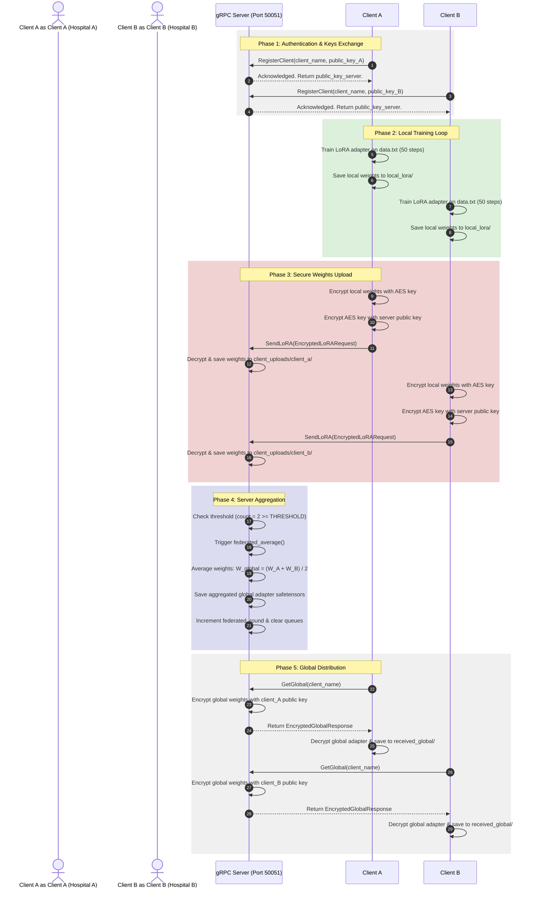

# AEGIS Mini-Project: Federated Learning System Technical Report

---

## 1. Executive Architecture Summary

The **AEGIS Federated Learning System** (located in the `Mini Project/federated_project` directory) is a distributed, privacy-preserving machine learning system. It enables multiple client nodes to collaboratively train a shared LLM (using Gemma-3-4B or TinyLlama-1.1B parameters) without sharing raw local medical text datasets.

The system relies on three core technologies:
1.  **Low-Rank Adaptation (LoRA)**: Only low-rank matrices are fine-tuned locally, keeping weights small and easy to transfer.
2.  **gRPC Protocol Layer**: High-performance binary remote procedure calls (RPCs) over HTTP/2 TCP connections for weights transmission.
3.  **Hybrid Public-Key Encryption**: Symmetric AES payload encryption combined with asymmetric RSA key encapsulation, ensuring zero-knowledge weights aggregation.

---

## 2. Directory Layout & Subsystem Mapping

The federated system is organized into modular Python scripts:

```text
Mini Project/federated_project/
├── proto/
│   └── federated.proto          # gRPC contract defining RPC endpoints and payloads
│
├── server/
│   ├── grpc_server.py           # Threaded gRPC server on Port 50051; coordinates rounds
│   ├── aggregate.py             # Implements server-side Federated Averaging (FedAvg)
│   ├── security.py              # Server RSA/AES crypto keys management and client key registry DB
│   ├── client_uploads/          # Storage directory for decrypted client safetensors
│   └── global_lora/             # Storage directory for aggregated global model weights
│
├── client_a/                    # Hospital Node A client workspace
│   ├── data.txt                 # Local clinical text records dataset
│   ├── train.py                 # PyTorch/PEFT training loop script
│   ├── send_grpc.py             # RSA registration and encrypted LoRA upload script
│   ├── request_global.py        # Requests, downloads, and decrypts the global model
│   ├── security_client.py       # Client-side RSA/AES cryptography utility
│   ├── local_lora/              # Storage directory for locally fine-tuned adapter weights
│   └── received_global/         # Storage directory for downloaded global adapter weights
│
├── client_b/                    # Client B workspace (same structure as client_a)
├── client_c/                    # Client C workspace (same structure as client_a)
│
├── test_lora.py                 # Tests base LLM loaded with global LoRA adapters
├── base_test.py                 # Tests base LLM without adapters (baseline control)
└── requirements.txt             # PyTorch, transformers, peft, safetensors, and grpcio requirements
```

---

## 3. Communication Protocols & gRPC Contracts

The communication interface is defined in [proto/federated.proto](file:///c:/aegis/Mini%20Project/federated_project/proto/federated.proto). It exposes four primary RPC methods:

```protobuf
syntax = "proto3";

package federated;

service FederatedService {
  rpc RegisterClient (RegisterRequest) returns (RegisterResponse);
  rpc SendLoRA (EncryptedLoRARequest) returns (LoRAResponse);
  rpc GetGlobal (GlobalRequest) returns (EncryptedGlobalResponse);
  rpc Heartbeat (HeartbeatRequest) returns (HeartbeatResponse);
}
```

### 3.1. RPC Lifecycle
1.  **RegisterClient**: Client registers its RSA public key with the server and receives the server's public key in return.
2.  **Heartbeat**: Client sends periodic keep-alive pings to update server status telemetry.
3.  **SendLoRA**: Uploads encrypted local LoRA weights after local training finishes.
4.  **GetGlobal**: Client requests the aggregated global LoRA weights from the server once the current training round completes.

---

## 4. Subsystem Implementations

### 4.1. Local Fine-Tuning Loop (`client_a/train.py`)
Clients train local model parameters using PyTorch and PEFT:
*   **Base Model Baseline**: Loads a baseline model (such as `Gemma-3-4B` or `TinyLlama-1.1B`) locally into CPU/GPU memory in float16 precision.
*   **Adapter Lifecycle**:
    *   Checks for the existence of `received_global/adapter_config.json`.
    *   If it exists, the client mounts the global model weights via `PeftModel.from_pretrained()`.
    *   If not, it initializes a new adapter using `LoraConfig` ($r=8$, $\alpha=16$, dropout $=0.05$, targeting projection layers `q_proj` and `v_proj`).
*   **Dataset Loading**: Reads raw clinical text from `data.txt` and sets target labels equal to the input tokens.
*   **Gradient Optimization**: Runs 50 gradient optimization steps using the AdamW optimizer with a learning rate of $2 \times 10^{-4}$ to minimize cross-entropy loss.
*   **Adapter Commit**: Saves local weights (`adapter_model.safetensors`, `adapter_config.json`) to `local_lora/`.

---

### 4.2. Hybrid Cryptographic Pipeline (`security.py` / `security_client.py`)
To prevent eavesdropping on weight updates, the system uses hybrid encryption:

```
                            [Weights Safetensors Payload]
                                          │
                                          ▼
                               ┌─────────────────────┐
                               │ Generate Random     │
                               │ AES-256 Symmetric   │
                               │ Encryption Key      │
                               └──────────┬──────────┘
                                          │
                  ┌───────────────────────┴───────────────────────┐
                  ▼                                               ▼
         [Payload Encrypter]                              [Key Encapsulator]
     - AES-256-CBC encryption                         - RSA-OAEP encryption
     - Encrypts weights & config                      - Encrypts AES key with
       using AES key + unique IVs                       recipient public key
                  │                                               │
                  ▼                                               ▼
          (Ciphertext Payloads)                           (Encrypted AES Key)
                  │                                               │
                  └───────────────────────┬───────────────────────┘
                                          ▼
                         [Transmitted gRPC Message Envelope]
```

#### Encryption Workflow (`send_grpc.py`):
1.  Generates a one-time symmetric AES key.
2.  Encrypts the AES key using the recipient's RSA public key.
3.  Encrypts weights and configuration payloads using the AES key in CBC mode.
4.  Sends the encrypted payloads along with the initialization vectors (IVs) to the server.

#### Decryption Workflow (`grpc_server.py`):
1.  Decrypts the AES key using the recipient's RSA private key.
2.  Decrypts the weights and configuration payloads using the decrypted AES key.

---

### 4.3. Server Aggregation and FedAvg (`aggregate.py` / `grpc_server.py`)
The central gRPC server coordinates training rounds:
*   **Upload Threshold**: Listens on port 50051. The server queues incoming client weights inside `client_uploads/`.
*   **Aggregation Trigger**: When the number of unique client uploads reaches `THRESHOLD` (default: `2`), the server starts the aggregation process:
    $$\text{received\_clients} \ge \text{THRESHOLD}$$
*   **Federated Averaging**: Loads the safetensors weights for each client and averages the layer tensors element-wise:
    $$W_{\text{global}}^{l} = \frac{1}{N} \sum_{i=1}^{N} W_{\text{client}_i}^{l}$$
    Where $W^l$ represents the weight matrix of LoRA adapter layer $l$, and $N$ is the number of participating clients.
*   **Global Commit**: Saves the averaged tensors as `adapter_model.safetensors` inside `global_lora/` and increments `federated_round`.

---

## 5. System Execution Flow

The sequence diagram below shows how clients train and aggregate weights across multiple rounds:


