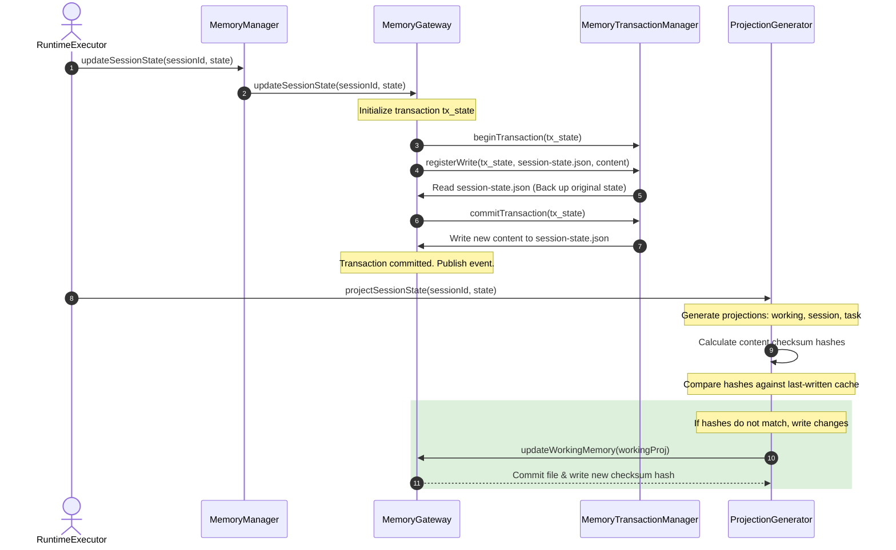
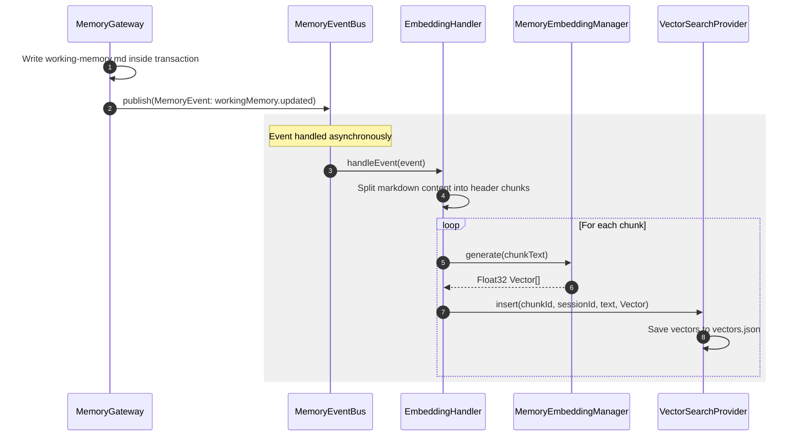
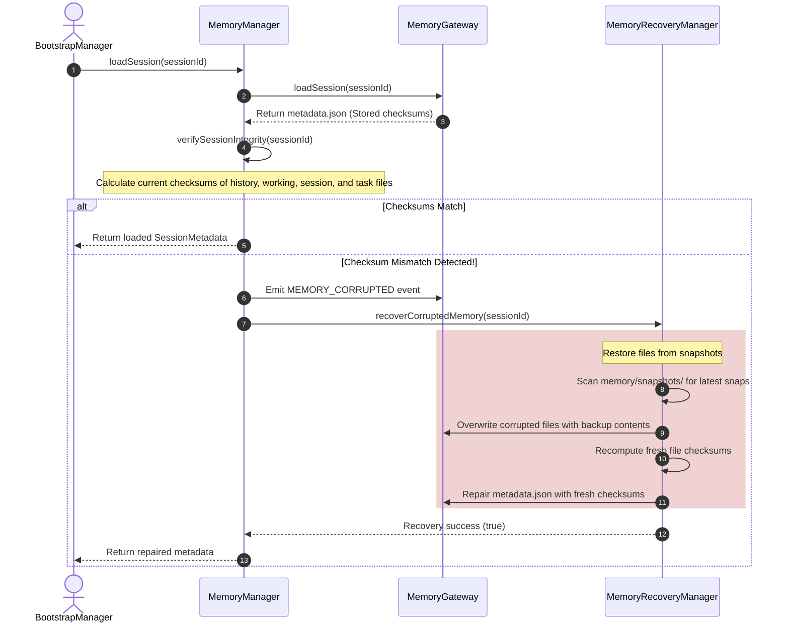

# AEGIS Cognitive Memory Subsystem: Architectural & Implementation Deep-Dive

---

## 1. Overview of the Cognitive Memory Subsystem

The **AEGIS Cognitive Memory Subsystem** is an event-driven, multi-tiered memory platform designed to manage AI agent state, session history, semantic retrieval, and transaction-safe database writes.

Unlike standard LLM agents that rely on simple linear history logs, AEGIS segregates memory into separate functional layers to minimize context size, support long-term reasoning, prevent hallucinations, and ensure strict data protection compliance:

```
                  ┌────────────────────────────────────────────────────────┐
                  │              COGNITIVE AGENT RUNTIME KERNEL            │
                  └───────────────────────────┬────────────────────────────┘
                                              │
                    ┌─────────────────────────┴─────────────────────────┐
                    ▼                                                   ▼
         [Active Short-Term Layer]                           [Semantic Memory Layer]
   ┌───────────────────────────────────┐               ┌───────────────────────────────────┐
   │ - working-memory.md (Objectives)  │               │ - Vector Database Index (JSON)    │
   │ - task.md (Active/Pending lists)  │               │ - BM25 Keyword Indexing           │
   │ - history.json (Raw chronological)│               │ - Local Ollama Embeddings         │
   └────────────────┬──────────────────┘               └────────────────┬──────────────────┘
                    │                                                   │
                    │               ┌──────────────────┐                │
                    ├──────────────►│ MEMORY EVENT BUS │◄───────────────┤
                    │               └────────┬─────────┘                │
                    ▼                        │                          ▼
         [Episodic Memory Layer]             │               [Relational Memory Layer]
   ┌───────────────────────────────────┐     │         ┌───────────────────────────────────┐
   │ - reflections.json (Audit traces) │◄────┼────────►│ - entities.json (Knowledge Graph) │
   │ - whatWorked / whatFailed traces  │     │         │ - Patients, Doctors, LoRA nodes   │
   └────────────────┬──────────────────┘     │         └────────────────┬──────────────────┘
                    │                        ▼                          │
                    │             ┌─────────────────────┐               │
                    └────────────►│  Reflection Engine  │◄──────────────┘
                                  └──────────┬──────────┘
                                             ▼
                                  ┌─────────────────────┐
                                  │ Transaction Gateway │
                                  │ (Mutex locks/ACID)  │
                                  └──────────┬──────────┘
                                             ▼
                                  ┌─────────────────────┐
                                  │  Local Disk Storage │
                                  └─────────────────────┘
```

---

## 2. Memory Subsystem File & Folder Layout

Memory storage and implementation files are distributed across the monorepo:

### 2.1. Codebase Components (`aegis-core/src/memory/`)
*   [MemoryManager.ts](file:///c:/aegis/aegis-core/src/memory/MemoryManager.ts) — Main coordinate facade managing session initialization, state swappings, snapshots, and compactions.
*   [MemoryGateway.ts](file:///c:/aegis/aegis-core/src/memory/MemoryGateway.ts) — Data Access Object (DAO) implementing transaction wrappers, checksum calculations, and dirty-aware cache buffers.
*   [ProjectionGenerator.ts](file:///c:/aegis/aegis-core/src/memory/ProjectionGenerator.ts) — Serializes structured JSON session states into Markdown files (`working-memory.md`, `session-memory.md`, `task.md`) for prompt injection.
*   **`transactions/`**
    *   [MemoryTransactionManager.ts](file:///c:/aegis/aegis-core/src/memory/transactions/MemoryTransactionManager.ts) — ACID scope controller backing up original content in memory and rolling back mutations if write operations fail.
*   **`locking/`**
    *   `MemoryLockManager.ts` — Mutex implementation blocking concurrent processes from writing to the same session files simultaneously.
*   **`recovery/`**
    *   `MemoryRecoveryManager.ts` — Scans `.snap` backup files chronologically to restore corrupted text or JSON records and repairs metadata checksum hashes.
*   **`refinement/`**
    *   [MemoryRefiner.ts](file:///c:/aegis/aegis-core/src/memory/refinement/MemoryRefiner.ts) — Prunes completed tasks, parses headers, and consolidates facts under a 1000-word limit constraint.
    *   [MemoryRankingManager.ts](file:///c:/aegis/aegis-core/src/memory/refinement/MemoryRankingManager.ts) — Implements dynamic importance ranking and scores items against exponential decay curves.
    *   [MemoryReflectionManager.ts](file:///c:/aegis/aegis-core/src/memory/refinement/MemoryReflectionManager.ts) — Evaluates history for failure mode retries and logs heuristics.
    *   [MemoryCompressionManager.ts](file:///c:/aegis/aegis-core/src/memory/refinement/MemoryCompressionManager.ts) — Calls the model provider to compress dialogue logs into compact JSON objects.
*   **`search/`**
    *   [MemorySearchManager.ts](file:///c:/aegis/aegis-core/src/memory/search/MemorySearchManager.ts) — Performs hybrid ranking searches merging vector cosine metrics and keyword matching scores.
    *   [VectorSearchProvider.ts](file:///c:/aegis/aegis-core/src/memory/search/VectorSearchProvider.ts) — Flat JSON vector index manager offering cosine distance evaluations.
*   **`embedding/`**
    *   [MemoryEmbeddingManager.ts](file:///c:/aegis/aegis-core/src/memory/embedding/MemoryEmbeddingManager.ts) — Interfaces with local Ollama APIs and features a fallback deterministic token-hashing mapping algorithm.
*   **`eventbus/`**
    *   [MemoryEventBus.ts](file:///c:/aegis/aegis-core/src/memory/eventbus/MemoryEventBus.ts) — Pub-Sub hub supporting namespace wildcards.
    *   `handlers/EmbeddingHandler.ts` — Microtask handler vectorizing document modifications in the background.
    *   `handlers/ReflectionHandler.ts` — Automatically triggers heuristic analysis upon session archival.
    *   `handlers/AuditLogger.ts` — Creates cryptographically signed access logs.

### 2.2. Workspace Storage Structure (`workspace/memory/`)
```text
workspace/memory/
├── sessions/
│   └── [sessionId]/                      # Folder containing active session state
│       ├── metadata.json                 # Lifecycle tags, quotas, and integrity checksums
│       ├── session-state.json            # JSON structure storing goals, tasks, and variables
│       ├── history.json                  # Message logs (User, Assistant, Tool, System roles)
│       ├── entities.json                 # Knowledge graph records mapping medical entities
│       ├── working-memory.md             # Markdown context projection for prompts
│       ├── session-memory.md             # Markdown projections for facts and preferences
│       └── task.md                       # Markdown projection tracking tasks
│
├── snapshots/
│   └── [sessionId]/                      # Point-in-time backup snapshots (.snap files)
│
├── embeddings/
│   └── vectors.json                      # Vector database document chunks and Float32 vectors
│
├── indexes/
│   └── ranking.json                      # Database tracking access logs and decay scores
│
├── reflections/
│   └── reflections.json                  # Historical reflections database (whatWorked / whatFailed)
│
├── archives/
│   └── [archive_record].json             # Cold storage zipped records for aged memories
│
└── trash/
    └── [sessionId]/                      # Temporarily deleted session folders awaiting deletion
```

---

## 3. Database Implementations & Algorithmic Design

### 3.1. Caching & Dirty-Aware Operations (`MemoryGateway.ts`)
To prevent disk write bottlenecks, `MemoryGateway` implements a double-caching and flushing system:
*   **`metadataCache` & `historyCache`**: Raw session meta and message logs are loaded once and stored in memory. Reads query these caches directly.
*   **`accessedSessions` Timestamp Debounce**: Reads update `meta.lastAccessedAt` inside the cached metadata. Instead of rewriting `metadata.json` immediately, the session ID is added to a debounce list. Timestamps are written to disk at the end of the conversation turn.
*   **`historyDirty` Buffering**: Appending messages writes to `historyCache` and flags the session as "dirty". The file `history.json` is only written when `flushHistory(sessionId)` is called by the `RuntimeExecutor` at the turn boundary.

---

### 3.2. Dynamic Importance Ranking & Exponential Aging Decay (`MemoryRankingManager.ts`)
AEGIS implements an automated aging cleanup system. Every memory item is evaluated using a dynamic weight decay score:

$$\text{Rank Score} = (\text{Importance} \times \text{Confidence}) \times e^{-\lambda \times \Delta t} \times (1 + \ln(F))$$

*   **$\text{Importance}$ & $\text{Confidence}$**: Configured on creation ($0.0 \text{ to } 1.0$).
*   **$\lambda$ (decayRate)**: Configured decay speed coefficient.
*   **$\Delta t$ (ageDays)**: Time elapsed since the item was last accessed:
    $$\Delta t = \frac{t_{\text{current}} - t_{\text{lastAccessed}}}{1000 \times 60 \times 60 \times 24}$$
*   **$F$ (accessFrequency)**: Counter incremented on every read query.

#### Implementation (`MemoryRankingManager.ts`):
```typescript
public calculateScore(item: RankedMemoryItem, virtualTimeOffsetMs = 0): number {
  const lastAccessTime = new Date(item.lastAccessedAt).getTime();
  const futureTime = Date.now() + virtualTimeOffsetMs;
  const ageMs = Math.max(0, futureTime - lastAccessTime);
  const ageDays = ageMs / (1000 * 60 * 60 * 24);

  const baseScore = item.importance * item.confidence;
  const decay = Math.exp(-item.decayRate * ageDays);
  const frequencyMultiplier = 1 + Math.log(item.accessFrequency);

  return baseScore * decay * frequencyMultiplier;
}
```
During database sweeps, if an item's score falls below the `archiveThreshold` (default: `0.3`), the manager:
1. Deletes the item from `ranking.json`.
2. Packages it into an `ArchiveRecord` object.
3. Appends it to a cold storage archive file inside `memory/archives/`.

---

### 3.3. Hybrid Retrieval Architecture (`MemorySearchManager.ts`)
The search manager executes a hybrid query merging semantic vectors and lexical text matches:

```
                            [Search Text Query]
                                     │
                 ┌───────────────────┴───────────────────┐
                 ▼                                       ▼
        [Vector Embeddings]                     [Lexical Tokens]
    - local nomic-embed-text                - whitespace tokenization
    - Cosine Similarity match               - Term match ratio (BM25 style)
                 │                                       │
                 ▼                                       ▼
           (Semantic Score)                       (Keyword Score)
                 │                                       │
                 └───────────────────┬───────────────────┘
                                     ▼
                     [Weighted Score Combination]
                Score = 0.7 * Semantic + 0.3 * Keyword
                                     │
                                     ▼
                            [Sorted Top K Results]
```

#### Lexical Keyword Math:
$$\text{Keyword Score} = \frac{\text{matching\_tokens}}{\text{query\_tokens}}$$

#### Semantic Vector Cosine Distance Math:
$$\text{Cosine Similarity} = \frac{\vec{A} \cdot \vec{B}}{\|\vec{A}\| \|\vec{B}\|} = \frac{\sum_{i=1}^{n} A_i B_i}{\sqrt{\sum_{i=1}^{n} A_i^2} \sqrt{\sum_{i=1}^{n} B_i^2}}$$

#### Hybrid Combination:
$$\text{Score}_{\text{hybrid}} = 0.7 \times \text{Score}_{\text{semantic}} + 0.3 \times \text{Score}_{\text{keyword}}$$

---

### 3.4. Local GGUF & Fallback Token-Hashing Embeddings (`MemoryEmbeddingManager.ts`)
For offline or local deployments, `MemoryEmbeddingManager` attempts to call local Ollama instances to run the `nomic-embed-text` model. If Ollama is offline or times out, it falls back to a deterministic, high-performance mock embedding algorithm:
1. Tokenizes input text into lowercase string arrays.
2. For each token, computes a character polynomial hash value:
   $$\text{hash} = \sum_{i=0}^{\text{len}-1} \text{char}[i] \times 31^{\text{len}-1-i}$$
3. Assigns coordinates in a 768-dimensional float array by selecting three pseudo-random indices per token:
   $$\text{index}_j = |(\text{hash} + j \times 31)| \pmod{768} \quad \text{for } j \in [0, 1, 2]$$
4. Norm-normalizes the array to create a unit vector:
   $$\vec{V}_{\text{normalized}} = \frac{\vec{V}}{\sqrt{\sum_{k=1}^{768} V_k^2}}$$
This guarantees that matching lexical terms produce high cosine similarity results even when offline.

---

### 3.5. Safe Writing with Transaction Rollbacks (`MemoryTransactionManager.ts`)
To prevent partial file write corruption during sudden process restarts, the transaction manager implements transaction rollbacks:
*   **Write Registration**: Before editing a file, `registerWrite()` reads the file's current state and backs it up in-memory inside the transaction's active operations block.
*   **Commit Phase**: Attempts to rewrite all files. If an exception occurs, it intercepts the error and calls `rollbackTransaction()`.
*   **Rollback Phase**: Iterates through the transaction backup queue in **reverse order**, restoring original file states and deleting any new files created during the transaction.

---

## 4. Subsystem Interaction Flows

### Trace A: Update Session State and Project Markdown



---

### Trace B: Asynchronous Embedding & Semantic Vector Indexing



---

### Trace C: Integrity Check & Automated Recovery


