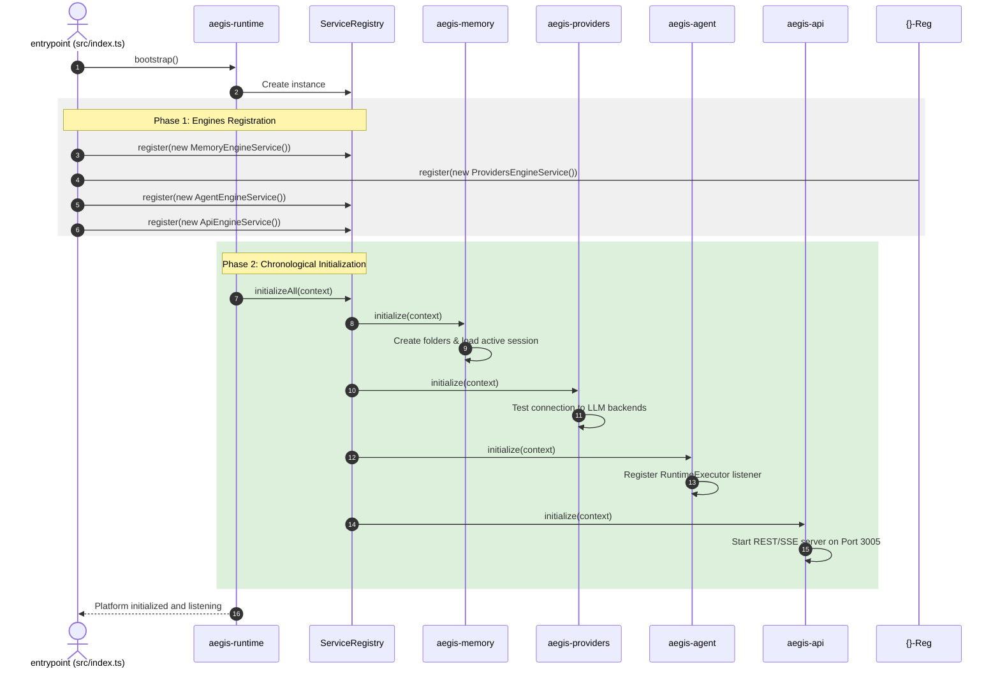

# AEGIS: Modular Platform Refactoring Blueprint
### Production-Grade Architecture for Independently Installable Engines

---

## 1. Executive Refactoring Vision

The goal of this refactoring is to transition the AEGIS platform from a monolithic application into a modular, decoupled ecosystem of **independent engines**. The central core of this new architecture is `aegis-runtime`, which serves as a lightweight, AI-agnostic infrastructure layer. All other capabilities—Agent reasoning, Cognitive Memory, Model Providers, Capability Loaders, and API Services—are refactored into self-contained packages.

These packages register themselves with the runtime's **Service Registry** and communicate asynchronously using the **Event Bus**. This design allows for different installation profiles (e.g., lightweight edge deployment vs. full cloud aggregator) without pulling in unnecessary modules or breaking compatibility with existing AEGIS code, configurations, or interfaces.

```
                    ┌──────────────────────────────────┐
                    │          aegis-runtime           │
                    │   - Service Registry & EventBus  │
                    │   - Workspace & Logger Context   │
                    └────────────────┬─────────────────┘
                                     │
       ┌──────────────┬──────────────┼──────────────┬──────────────┐
       ▼              ▼              ▼              ▼              ▼
 ┌───────────┐  ┌───────────┐  ┌───────────┐  ┌───────────┐  ┌───────────┐
 │   Agent   │  │  Memory   │  │ Providers │  │  Plugins  │  │Federation │
 │  Engine   │  │  Engine   │  │  Engine   │  │  Engine   │  │  Engine   │
 └───────────┘  └───────────┘  └───────────┘  └───────────┘  └───────────┘
```

---

## 2. New Folder Structure & Package Mapping

The monorepo structure is re-organized to separate concerns:

```text
aegis/
├── packages/
│   ├── aegis-runtime/                # MANDATORY INFRASTRUCTURE KERNEL
│   │   ├── package.json
│   │   ├── tsconfig.json
│   │   └── src/
│   │       ├── index.ts              # Exports registries, buses, and loggers
│   │       ├── registry/             # Dependency Injection & Service Registries
│   │       ├── eventbus/             # Infrastructure Event Bus engine
│   │       ├── workspace/            # Sandboxed Workspace Path Resolver
│   │       └── logging/              # Structured Logger implementation
│   │
│   ├── aegis-agent/                  # AGENT PLANNING & REACT ENGINE
│   │   ├── package.json              # Depends ONLY on aegis-runtime
│   │   └── src/
│   │       ├── index.ts              # Exports AgentService
│   │       ├── planner/              # ReAct Execution Loop & RuntimeExecutor
│   │       └── prompts/              # Prompt builders & formatters
│   │
│   ├── aegis-memory/                 # COGNITIVE MEMORY STORAGE ENGINE
│   │   ├── package.json              # Depends ONLY on aegis-runtime
│   │   └── src/
│   │       ├── index.ts              # Exports MemoryService
│   │       ├── storage/              # MemoryGateway (ACID Transactions)
│   │       └── indexing/             # Semantic indexes & graph traversal
│   │
│   ├── aegis-providers/              # MODEL INFERENCE CONNECTIVITY ENGINE
│   │   ├── package.json              # Depends ONLY on aegis-runtime
│   │   └── src/
│   │       ├── index.ts              # Exports ProviderService
│   │       └── managers/             # ProviderManager & GGUF/Ollama loaders
│   │
│   ├── aegis-plugins/                # PLUGIN MIDDLEWARE LOADER ENGINE
│   │   ├── package.json              # Depends ONLY on aegis-runtime
│   │   └── src/
│   │       ├── index.ts              # Exports PluginService
│   │       └── loader/               # Plugins loaders and lifecycles
│   │
│   ├── aegis-tools/                  # SYSTEM TOOL EXECUTION ENGINE
│   │   ├── package.json              # Depends ONLY on aegis-runtime
│   │   └── src/
│   │       ├── index.ts              # Exports ToolService
│   │       └── sandbox/              # Safe terminal/file/folder runners
│   │
│   ├── aegis-skills/                 # BEHAVIORAL SKILL EXECUTION ENGINE
│   │   ├── package.json              # Depends ONLY on aegis-runtime
│   │   └── src/
│   │       ├── index.ts              # Exports SkillService
│   │       └── executor/             # SkillLoader & execution contexts
│   │
│   ├── aegis-api/                    # HTTP REST & SSE CONNECTOR ENGINE
│   │   ├── package.json              # Depends ONLY on aegis-runtime
│   │   └── src/
│   │       ├── index.ts              # Exports ApiService
│   │       └── server/               # REST API Server on Port 3005
│   │
│   └── aegis-federation/             # [FUTURE] DISTRIBUTED FEDERATION ENGINE
│       ├── package.json              # Depends ONLY on aegis-runtime
│       └── src/
│           ├── index.ts              # Exports FederationService
│           └── consensus/            # Nodes discovery, secure FedAvg, dynamic roles
│
├── aegis-core/                       # MONOLITH BOOTSTRAP wrapper (backward compatible)
│   ├── package.json                  # Imports runtime, agent, memory, etc.
│   └── src/
│       └── index.ts                  # Orchestrates runtime bootstrap and ApiServer start
│
├── UI/                               # Front-End UI Dashboard (Port 5001 & GGUF Model Server)
├── workspace/                        # Execution storage environment
├── tools/                            # System capabilities directory
├── skills/                           # Medical AI behavioral capabilities
└── plugins/                          # Middleware integrations directory
```

---

## 3. Engine Dependency Graph

To prevent circular dependencies, all packages depend strictly on `aegis-runtime` and do not call each other directly.

```
          ┌────────────────────────────────────────────────────────┐
          │                      aegis-runtime                     │
          └────▲───────────▲────────────▲────────────▲───────────▲─┘
               │           │            │            │           │
       ┌───────┴───┐ ┌─────┴─────┐ ┌────┴─────┐ ┌────┴─────┐ ┌───┴───────┐
       │   Agent   │ │  Memory   │ │Providers │ │ Plugins  │ │Federation│
       │  Engine   │ │  Engine   │ │  Engine  │ │  Engine  │ │  Engine   │
       └───────────┘ └───────────┘ └───────────┘ └───────────┘ └───────────┘
```

### Dependency Rules:
1.  **Mandatory Kernel Only**: `aegis-runtime` has **zero** dependencies on other engines and contains no AI-specific logic.
2.  **Engine Independence**: An engine must never import from another engine. For example, `aegis-agent` must not import from `aegis-memory`.
3.  **Cross-Engine Requests**: If the Agent Engine needs to read working memory, it requests the `memory` service from the runtime's registry or listens for updates via the Event Bus.
4.  **Clean Compilation**: If any engine (e.g., `aegis-api`) is deleted from `package.json`, the rest of the project will compile without errors.

---

## 4. Service Registration & Lifecycles

Every engine exposes a standard registration service that implements the standard `IEngineService` lifecycle interface.

### 4.1. Core Interfaces (`aegis-runtime`)

```typescript
export interface IRuntimeContext {
  getService<T>(name: string): T;
  getWorkspacePath(): string;
  getEventBus(): IEventBus;
  getLogger(): ILogger;
}

export interface IEngineService {
  name: string;
  initialize(context: IRuntimeContext): Promise<void>;
  shutdown(): Promise<void>;
}

export interface IServiceRegistry {
  register(service: IEngineService): void;
  get<T>(name: string): T;
  initializeAll(context: IRuntimeContext): Promise<void>;
  shutdownAll(): Promise<void>;
}
```

---

### 4.2. Runtime Implementation (`aegis-runtime/src/registry`)

```typescript
export class ServiceRegistry implements IServiceRegistry {
  private services = new Map<string, IEngineService>();

  public register(service: IEngineService): void {
    if (this.services.has(service.name)) {
      throw new Error(`Service ${service.name} is already registered.`);
    }
    this.services.set(service.name, service);
  }

  public get<T>(name: string): T {
    const service = this.services.get(name);
    if (!service) {
      throw new Error(`Service ${name} not found in registry.`);
    }
    return service as unknown as T;
  }

  public async initializeAll(context: IRuntimeContext): Promise<void> {
    for (const service of this.services.values()) {
      context.getLogger().info(`[Runtime] Initializing service: ${service.name}...`);
      await service.initialize(context);
    }
  }

  public async shutdownAll(): Promise<void> {
    const servicesList = Array.from(this.services.values()).reverse();
    for (const service of servicesList) {
      try {
        await service.shutdown();
      } catch (err) {
        console.error(`Error shutting down service ${service.name}:`, err);
      }
    }
  }
}
```

---

### 4.3. Engine Service Registration Example (`aegis-memory`)

```typescript
import { IEngineService, IRuntimeContext } from '@aegis/runtime';
import { MemoryManager } from './MemoryManager.js';

export class MemoryEngineService implements IEngineService {
  public readonly name = 'memory';
  private manager!: MemoryManager;

  public async initialize(context: IRuntimeContext): Promise<void> {
    // 1. Resolve workspace storage from runtime authority
    const memoryPath = context.getWorkspacePath();
    
    // 2. Initialize memory manager
    this.manager = new MemoryManager(memoryPath, context.getEventBus(), context.getLogger());
    await this.manager.init();
  }

  public async shutdown(): Promise<void> {
    await this.manager.shutdown();
  }

  // Expose implementation details via type-safe public interfaces
  public getManager(): MemoryManager {
    return this.manager;
  }
}
```

---

## 5. Future Federation Engine Integration Architecture

The platform is designed to support the integration of the future **AEGIS Federation Engine** (`aegis-federation`) as an independent module. This module will handle distributed intelligence and collaborative network operations across AEGIS.

### 5.1. Runtime Extension Points (Zero Runtime Modifications)
To ensure the `aegis-federation` package can be added later without changes to the runtime core:
1.  **Dynamic Service Mounting**: The `ServiceRegistry` permits runtime mounting of the `federation` service during startup.
2.  **Namespace Event Bus Routing**: The `MemoryEventBus` and runtime `EventBus` support the `federation.*` topic namespace (e.g., `federation.weights_ready`, `federation.node_joined`).
3.  **Path Resolution Hooks**: The `WorkspaceManager` exposes standard endpoints for federated storage paths (e.g., `/workspace/federation/uploads`, `/workspace/federation/received_global`).
4.  **Middleware Hook Registries**: The Plugin Engine provides interceptor hooks where the Federation Engine can register callbacks to intercept state saves and trigger secure aggregation validations.

### 5.2. Federation Engine Scope of Responsibilities
When implemented, the Federation Engine will manage:
*   **Distributed Topology**: Node Management, Dynamic Node Roles, Capability Discovery, and Edge Synchronization.
*   **Resource Coordination**: Hardware Profiling, Resource Scheduling, Job Scheduling, and Monitoring.
*   **Collaborative Training**: Local Training, Dataset Construction, LoRA Management, Adapter Lifecycle, secure Model Distribution, Global Model Synchronization, and Distillation Pipelines.
*   **Secure Consensus**: Secure Communication, Trust Scoring, Aggregation Algorithms (FedAvg), Secure Aggregation, Validation Nodes Consensus, Fault Recovery, Deployment Pipelines, and Model Registry Integration.

---

## 6. Event-Driven Communication Between Engines

Direct dependencies are replaced with asynchronous events published on the runtime's `EventBus`.

```
                    ┌────────────────────────┐
                    │    Runtime EventBus    │
                    └───────────▲────────────┘
                                │ Publish
             ┌──────────────────┴──────────────────┐
             │ MemoryEngine:                       │
             │ MemoryEvent: 'workingMemory.updated'│
             └─────────────────────────────────────┘
                                │ Dispatch
             ┌──────────────────┴──────────────────┐
             │ Subscribers:                        │
             │ - AgentEngine (Update Prompt Plan)  │
             │ - ApiEngine (Push SSE Status to UI) │
             └─────────────────────────────────────┘
```

### Event Payload Schema

```typescript
export interface MemoryEvent<T = any> {
  eventId: string;
  topic: string;
  timestamp: string;
  sessionId: string;
  actor: string;
  payload: T;
}
```

### Subscriber Registration Code

```typescript
// Inside aegis-agent initialization
context.getEventBus().subscribe('workingMemory.updated', async (event: MemoryEvent) => {
  // Agent updates its internal prompt planning state when working memory changes
  const newObjective = event.payload.currentObjective;
  agentPlanner.updateActiveObjective(newObjective);
});
```

---

## 7. Workspace Ownership Strategy

*   **Runtime Authority**: The `aegis-runtime` package is the single authority for workspace path resolution.
*   **Path Resolution**:
    *   No package should use `__dirname` or relative paths to find the workspace directory.
    *   Engines query paths using `context.getWorkspacePath()`.
*   **Sandbox Enforcement**: `aegis-runtime` includes the path sandbox utility, which checks if file writes remain inside the workspace path boundary before executing.

---

## 8. Modular Installation Profiles

The monorepo configuration supports different installation profiles by controlling which engines are registered. These profiles adapt the platform to various deployment environments without modifying the code of the engines themselves.

```
Personal AI Profile:
[Runtime] ◄─── [Agent] ◄─── [Memory]

Edge AI Node Profile:
[Runtime] ◄─── [Agent] ◄─── [Memory] ◄─── [Federation]

Enterprise Server Profile:
[Runtime] ◄─── [Federation] ◄─── [Registry] ◄─── [Monitoring]

Cloud Aggregator Profile:
[Runtime] ◄─── [Federation] ◄─── [Registry] ◄─── [Security] ◄─── [Monitoring]

Future Autonomous Systems Profile:
[Runtime] ◄─── [Federation] ◄─── [Vision] ◄─── [Speech] ◄─── [Memory] ◄─── [Robotics]
```

### 8.1. Profile Configurations

#### 1. Personal AI
*   **Core Packages**: `aegis-runtime`, `aegis-agent`, `aegis-memory`.
*   **Use Case**: Run locally on single edge machines, patient laptops, or edge clinics where no network collaboration is required.

#### 2. Edge AI Node
*   **Core Packages**: `aegis-runtime`, `aegis-agent`, `aegis-memory`, `aegis-federation`.
*   **Use Case**: Run in hospitals, clinics, or research edge networks where local models learn from private data and share LoRA adapters securely.

#### 3. Enterprise Server
*   **Core Packages**: `aegis-runtime`, `aegis-federation`, `aegis-registry`, `aegis-monitoring`.
*   **Use Case**: Central servers coordinating distributed nodes, scheduling jobs, and running aggregated validations.

#### 4. Cloud Aggregator
*   **Core Packages**: `aegis-runtime`, `aegis-federation`, `aegis-registry`, `aegis-security`, `aegis-monitoring`.
*   **Use Case**: High-availability, secure cloud coordination layers handling zero-knowledge aggregation.

#### 5. Future Autonomous Systems
*   **Core Packages**: `aegis-runtime`, `aegis-federation`, `aegis-vision`, `aegis-speech`, `aegis-memory`, `aegis-robotics`.
*   **Use Case**: Robotics hardware nodes integrating sensory perception, physical speech, and motion controllers.

---

## 9. Boot Sequence After Modularization



---

## 10. Migration Plan & File Reallocations

To safely migrate to this modular structure, files are moved from the monolithic `aegis-core/src` folder to their respective engine packages without modifying internal logic.

### File Relocation Mapping:

| Original Monolithic File | Target Engine Package Path | Refactoring Reason |
| :--- | :--- | :--- |
| `src/runtime/WorkspaceManager.ts` | `aegis-runtime/src/workspace/WorkspaceManager.ts` | Relocates path resolution to the core infrastructure kernel. |
| `src/events/*` | `aegis-runtime/src/eventbus/*` | Moves event definitions and emitters to the shared runtime. |
| `src/utils/logger.ts` | `aegis-runtime/src/logging/StructuredLogger.ts` | Standardizes logging across all engines. |
| `src/agent/*` | `aegis-agent/src/planner/*` | Houses agent prompt building and chat streaming logic. |
| `src/runtime/RuntimeExecutor.ts` | `aegis-agent/src/planner/RuntimeExecutor.ts` | Restructures the main ReAct loop as part of the Agent Engine. |
| `src/memory/*` | `aegis-memory/src/storage/*` | Groups gateways, refinement managers, and indexes in the Memory Engine. |
| `src/providers/*` | `aegis-providers/src/managers/*` | Exposes local GGUF and Ollama model provider bindings. |
| `src/plugins/*` | `aegis-plugins/src/loader/*` | Manages background plugin registration. |
| `src/tools/*` | `aegis-tools/src/sandbox/*` | Isolates system shell tools. |
| `src/skills/*` | `aegis-skills/src/executor/*` | Isolates skill loader behaviors. |
| `src/api/ApiServer.ts` | `aegis-api/src/server/ApiServer.ts` | Decouples Server-Sent Events (SSE) from the core kernel. |

---

## 11. Future Extensibility (e.g., Vision/Speech Engines)

Future engines (like `aegis-vision` or `aegis-federation`) can be added without modifying the runtime or other engines.

### Vision Engine Integration Example:

1.  **Define Service**:
    ```typescript
    import { IEngineService, IRuntimeContext } from '@aegis/runtime';

    export class VisionEngineService implements IEngineService {
      public readonly name = 'vision';

      public async initialize(context: IRuntimeContext): Promise<void> {
        context.getEventBus().subscribe('camera.capture', async (imgData) => {
          // Process frame updates
        });
      }

      public async shutdown(): Promise<void> {}
    }
    ```
2.  **Register Service**:
    Add `aegis-vision` to `package.json` and register the service during boot:
    ```typescript
    import { VisionEngineService } from '@aegis/vision';
    serviceRegistry.register(new VisionEngineService());
    ```
No existing files in `aegis-runtime`, `aegis-agent`, or `aegis-memory` need to be modified.
