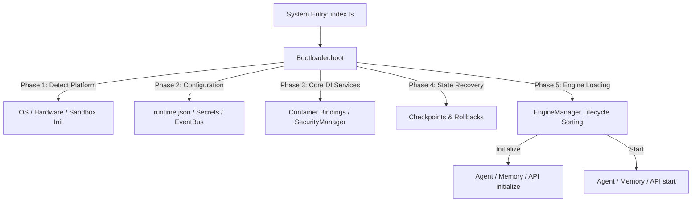
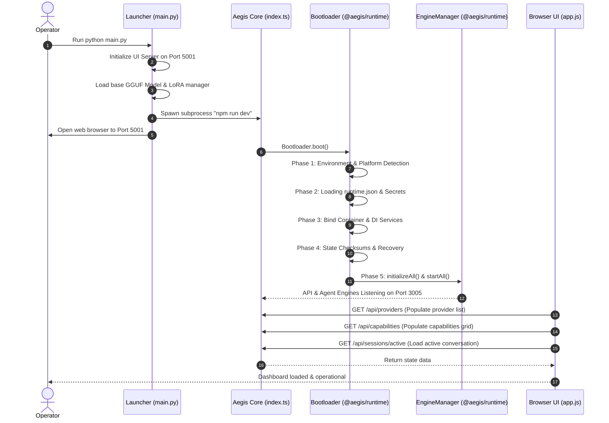
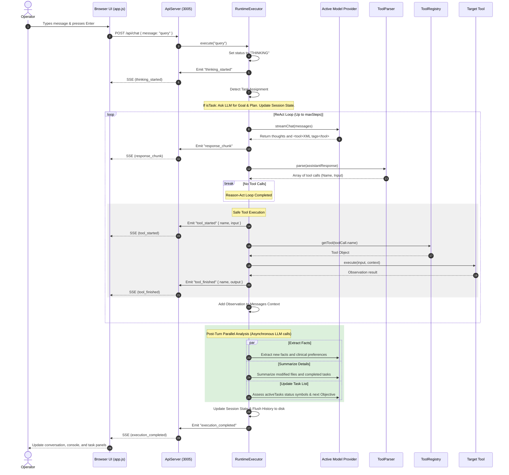
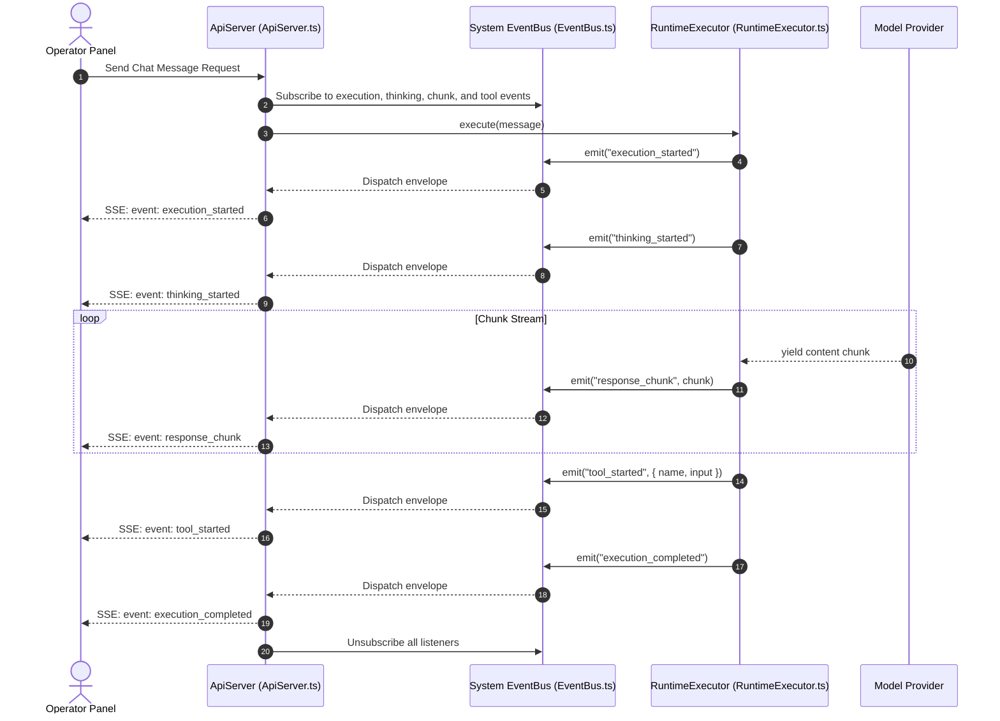
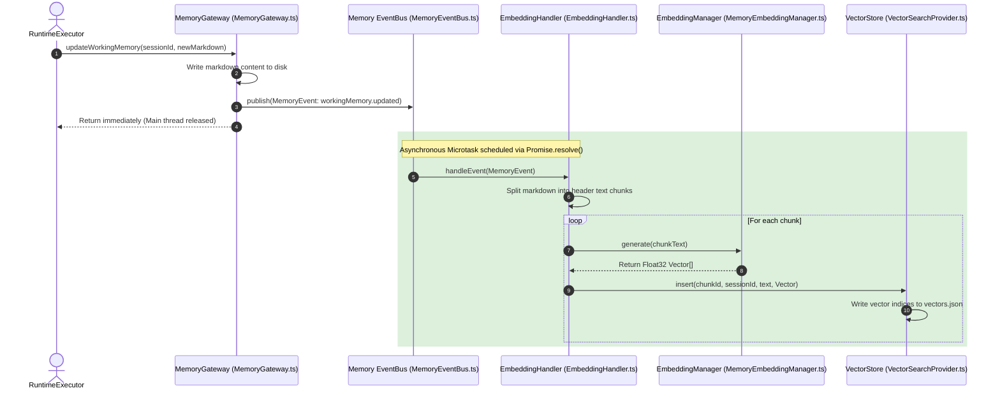
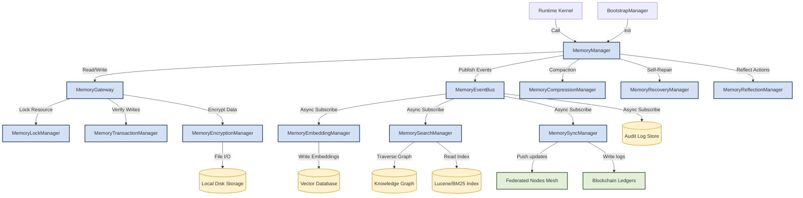

# AEGIS: Decentralized Privacy-Preserving Federated Medical AI Ecosystem
## Comprehensive Project State & Directory Architecture Report
**Generated on:** July 11, 2026  
**Project Workspace Location:** `C:\aegis`  
**Status:** Completed and Frozen under v1.0 Production Kernel Specification.

---

## 1. Executive Summary & Vision

**AEGIS** is a next-generation decentralized medical AI ecosystem engineered for privacy-preserving federated intelligence. The platform allows medical institutions (hospitals, edge clinics, research networks) to collaboratively train AI models without sharing raw patient data.

### Key Conceptual Architectural Pillars
*   **Privacy-Preserving Federated Learning:** Medical records stay local. Only training updates (fine-tuning deltas) are transmitted.
*   **Selective LoRA (Low-Rank Adaptation):** Instead of sharing full model parameters, only lightweight adapter weights (`adapter_model.safetensors`) are sent. This minimizes communication overhead and supports deployment on low-resource edge devices.
*   **Byzantine-Resistant Validation & Consensus:** Dynamic server networks inspect and validate incoming updates to prevent model poisoning attacks.
*   **gRPC Communication Mesh:** High-performance, low-latency, HTTP/2-based serialization layer using Protocol Buffers.
*   **Tensor Risk Evaluation:** Gradient norm analysis, cosine similarity validation, and anomaly detection to tag incoming weights as safe, sensitive, or risky.
*   **Reputation & Scoring:** Dynamic client trust scoring based on historical participation, heartbeat consistency, and validation agreement.
*   **DP-RAG (Differentially Private Retrieval-Augmented Generation):** Local vector databases combined with controlled noise injection to protect query privacy during document retrieval.
*   **FHIR Interoperability:** HL7 FHIR structured mapping for seamless cross-institutional medical data exchange.

---

## 2. Platform Architecture & Modular Workspace Structure

The project uses a **Microkernel (Hexagonal) Monorepo Architecture** where all packages depend strictly on the `@aegis/sdk` API layer. Pluggable engines implement standard lifecycle interfaces and communicate via the multi-domain event bus.

### 2.1. Monorepo Package Topology
```text
                         ┌─────────────────────────────────┐
                         │   @aegis/sdk (Stable Contract)  │
                         │  - Kernel API, Context, Engines │
                         └────────────────▲────────────────┘
                                          │ implements
                         ┌────────────────┴────────────────┐
                         │  @aegis/runtime (Core Kernel)   │
                         │  - Bootloader, DI, EventBus, FS │
                         └────────────────▲────────────────┘
                                          │ loads
         ┌────────────────────────────────┼────────────────────────────────┐
         ▼                                ▼                                ▼
┌─────────────────┐              ┌─────────────────┐              ┌─────────────────┐
│  @aegis/agent   │              │  @aegis/memory  │              │   @aegis/api    │
│ (Agent Engine)  │              │ (Memory Engine) │              │  (REST Engine)  │
└─────────────────┘              └─────────────────┘              └─────────────────┘
```

### 2.2. Active Workspace Layout (`package.json`)
The root workspace is configured as follows:
```json
{
  "name": "aegis-monorepo",
  "type": "module",
  "workspaces": [
    "aegis-core",
    "interfaces/terminal",
    "packages/*"
  ]
}
```

### 2.3. Modular Packages under `packages/`
1.  **`@aegis/sdk` (`packages/aegis-sdk`):** The stable public interface definitions (`IKernelAPI_v1`, `IRuntimeContext_v1`, `IEngine`, `IEngineMetadata`). All engines depend strictly on the SDK.
2.  **`@aegis/runtime` (`packages/aegis-runtime`):** The core kernel of the system. It runs the Bootloader, registers services in the DI Container, and maintains EventBuses and Sandboxes.
3.  **`@aegis/agent` (`packages/aegis-agent`):** The pluggable AI Agent planning engine. It exports `AgentEngine` to hook into the runtime lifecycle.
4.  **`@aegis/memory` (`packages/aegis-memory`):** The pluggable Cognitive Memory engine. It exports `MemoryEngine` to handle vector indexing and transactional rollbacks.
5.  **`@aegis/api` (`packages/aegis-api`):** The pluggable REST API connector engine, exporting `ApiEngine`.
6.  **`@aegis/plugins` (`packages/aegis-plugins`):** Background middleware extension systems.
7.  **`@aegis/providers` (`packages/aegis-providers`):** Local model inference connections (Ollama, local GGUF loaders) and API configurations.
8.  **`@aegis/skills` (`packages/aegis-skills`):** Behavioral capability loading engine.
9.  **`@aegis/tools` (`packages/aegis-tools`):** Safe filesystem, terminal, and database tool execution sandbox.

---

## 3. Data Flow & Core Process Diagrams

This section details the critical sequences governing core system boot processes, operator turn executions, and federated learning training flows.

### 3.1. System Entry & Boot Sequence
The boot sequence is managed by the `@aegis/runtime` `Bootloader`, which performs a deterministic, 5-phase execution flow resolving the 25 required boot stages:



### 3.2. Detailed Boot Sequence Lifecycle Trace
This sequence diagram tracks the coordination between python launchers, microservice servers, and frontend browsers during startup:



### 3.3. Operator Conversation Turn Execution Flow (ReAct Loop)
When a query is parsed, the `RuntimeExecutor` coordinates reasoning cycles, safe tool invocations, and post-turn optimizations:



### 3.4. Federated LoRA Learning Loop
The raw Python-based research simulation coordinates local hospital nodes and server aggregation:

```text
 hospital-a (client_a/)             Central Server (server/)             hospital-b (client_b/)
 ┌────────────────────┐              ┌──────────────────────┐             ┌────────────────────┐
 │  Local EHR Data    │              │  Byzantine-Resistant │             │  Local EHR Data    │
 │  (data.txt)        │              │  Validation Mesh     │             │  (data.txt)        │
 └─────────┬──────────┘              └──────────┬───────────┘             └─────────┬──────────┘
           │ Local LoRA                         │                                   │ Local LoRA
           ▼ Fine-Tuning                        │                                   ▼ Fine-Tuning
 ┌────────────────────┐              ┌──────────▼───────────┐             ┌────────────────────┐
 │ Local Adapter      │              │ Federated Averaging  │             │ Local Adapter      │
 │ (safetensors)      │              │   W_global = Σ(W)/N  │             │ (safetensors)      │
 └─────────┬──────────┘              └──────────▲───────────┘             └─────────┬──────────┘
           │                                    │                                   │
           │ Upload via gRPC (send_grpc.py)     │ Upload via gRPC (send_grpc.py)    │
           └───────────────────────────────────►┼◄──────────────────────────────────┘
                                                │
                                                ▼ Update Global Model
                                     ┌──────────────────────┐
                                     │ Global Adapter       │
                                     │ (global_lora/)       │
                                     └──────────┬───────────┘
                                                │
           Request Global (request_global.py)   │ Request Global (request_global.py)
           ◄────────────────────────────────────┴───────────────────────────────────►
```

---

## 4. Event Bus Architecture

AEGIS employs two decoupled event bus systems to separate UI completions from raw storage updates, ensuring the primary execution thread remains non-blocking.

```text
┌────────────────────────────────────────────────────────────────────────┐
│                          AEGIS RUNTIME KERNEL                          │
└──────────────┬──────────────────────────────────────────┬──────────────┘
               │                                          │
               ▼                                          ▼
     [System Runtime EventBus]                 [Memory Subsystem EventBus]
   - EventBus.ts (Synchronous)                 - MemoryEventBus.ts (Asynchronous)
   - Exposes: execution_started,               - Exposes: workingMemory.updated,
     thinking_started, response_chunk,           sessionMemory.updated, entity.updated,
     tool_started, command_executed, etc.        history.appended, snapshot.created, etc.
               │                                          │
        ┌──────┴──────┐                            ┌──────┴──────┐
        ▼             ▼                            ▼             ▼
  [API Server]  [Terminal UI]             [EmbeddingHandler] [ReflectionHandler]
  - streams SSE - renders logs            - Nomical vectors  - Extracts rules
    responses     to operator               generation         from history
```

### 4.1. Trace: Streamed UI Inference (System Event Bus)
The API server listens to runtime events synchronously to yield instant Server-Sent Events (SSE) packet transfers to client dashboards:



### 4.2. Trace: Asynchronous Memory Operations (Memory Event Bus)
Data changes broadcast events on the `MemoryEventBus`. Listeners execute asynchronously on background microtasks, letting the agent complete reasoning cycles without waiting for heavy disk/embedding write locks:



---

## 5. Cognitive Memory Subsystem & Memory Bus

The Memory Subsystem integrates Short-Term Context, a Semantic Retrieval Layer, a Knowledge Graph, and transactional safety guarantees.

### 5.1. Multi-Tiered Memory Pipeline Map
```text
┌────────────────────────────────────────────────────────────────────────────────────────┐
│                              COGNITIVE AGENT RUNTIME KERNEL                            │
└────────────────────────────────┬───────────────────────────────────────────────────────┘
                                 │
                  ┌──────────────┴──────────────┐
                  ▼                             ▼
       [Active Context Layer]        [Semantic Memory Layer]
 ┌─────────────────────────────────┐   ┌─────────────────────────────────┐
 │   Working Memory (Short-Term)   │   │        Vector Memory (RAG)      │
 │   - Goals, Objectives, Tasks    │   │        - Embedding Cache        │
 │   - Markdown Projections        │   │        - Semantic Retrieval     │
 └────────────────┬────────────────┘   └────────────────┬────────────────┘
                  │                                     │
                  │   ┌──────────────────────────┐      │
                  ├──►│     MEMORY EVENT BUS     │◄─────┤
                  │   └──────────┬───────────────┘      │
                  ▼              │                      ▼
       [Episodic Memory Layer]   │            [Relational Memory Layer]
 ┌─────────────────────────────────┐│      ┌─────────────────────────────────┐
 │       Execution History         ││      │      Clinical Knowledge Graph   │
 │       - Successful Workflows    │◄──────┼─────►│      - Medical entities         │
 │       - Failed reasoning traces ││      │      - Node relationships       │
 └────────────────┬────────────────┘│      └────────────────┬────────────────┘
                  │                 ▼                       │
                  │      ┌─────────────────────┐            │
                  └─────►│  Reflection Engine  │◄───────────┘
                         └──────────┬──────────┘
                                    │
                                    ▼
                         ┌─────────────────────┐
                         │   Storage Adapter   │
                         │ (JSON / SQLite / DB)│
                         └─────────────────────┘
```

### 5.2. Component Interaction Topology
This topology details the relationship between kernel boot modules, transactional gateways, disk databases, and async indexers:



---

## 6. Minute Directory Inventory

Below is the complete, detailed directory tree mapping of all files in the project workspace, excluding `node_modules`, `.git`, `venv`, and `dist` build folders.

### 6.1. Project Root Directory
*   `aegis_architecture_review.md` - Technical review of monolithic constraints.
*   `aegis_cognitive_memory_redesign.md` - In-depth engineering design of the event-driven multi-tiered memory architecture.
*   `aegis_core_runtime_specification.md` - Official v1.0 specification constitution locking the microkernel design.
*   `aegis_event_bus_report.md` - Specification of asynchronous messaging and event schemas.
*   `aegis_federated_learning_report.md` - Documentation on Python-based LoRA federation.
*   `aegis_memory_subsystem_report.md` - Original review of local file locking and checksum recovery.
*   `aegis_modular_refactoring_blueprint.md` - Technical guidelines for dividing the monolith into packages.
*   `aegis_system_architecture_report.md` - Core system architectural design report.
*   `install.ps1` - PowerShell production installer script mapping CPU/RAM profiles.
*   `LICENSE` - Open-source license (MIT).
*   `package.json` - Root NPM monorepo workspaces configuration.
*   `package-lock.json` - Dependency lockfile.
*   `README.md` - Global user guide and system overview.
*   `testBoot.ts` - Script validating the bootloader and dynamic engine load cycle.

---

### 6.2. `aegis-core/`
This directory acts as the main bootstrap wrapper, holding the legacy code and active validation files.

*   `aegis-core/.env` - Environment configurations.
*   `aegis-core/package.json` - Defines startup scripts (`dev`, `start`, `build`), and lists dependencies (`ollama`, `react`, `ink`, `inquirer`, `commander`, `eventemitter3`, `execa`, `zod`, `@aegis/runtime`, etc.).
*   `aegis-core/tsconfig.json` - TypeScript compiler specifications.
*   `aegis-core/bin/aegis.js` - Command execution binary.
*   `aegis-core/scripts/` - Shell scripts for bootstrap automation (`dev.sh`, `install.sh`, `start.sh`).
*   **Validation Core Scripts (`aegis-core/src/`):**
    *   `index.ts` - Entry point bootstrapping `BootstrapManager` and initiating the API server.
    *   `validate_eventbus.ts` - Validates the memory event bus pub-sub pipelines, logs audits, and checks assertions.
    *   `validate_memory.ts` - Tests read/write operations, transactions, and locking systems of `MemoryGateway`.
    *   `validate_ranking.ts` - Tests calculations for memory decay rates, confidence thresholds, and importance rankings.
    *   `validate_reflection.ts` - Asserts the execution of LLM-based asynchronous reflection strategy extractions.
    *   `validate_runtime_sessions.ts` - Comprehensive script testing safe boot modes, checkpoints, recovery, session switching, soft deletes, and quarantining.
    *   `validate_semantic.ts` - Tests embedding generations, similarity search metrics, and BM25 hybrid ranking.
    *   `validate_versioning.ts` - Verifies git-like commit histories, branches, merges, and conflict resolutions for session memories.
*   **Legacy/Transitioning Source Code (`aegis-core/src/...`):**
    *   `agent/` - Agent planning (`Agent.ts`), formatter (`MessageFormatter.ts`), prompt systems (`PromptBuilder.ts`).
    *   `api/` - HTTP API Server (`ApiServer.ts`).
    *   `commands/` - Command registration, permission routing, contexts, and runtime services.
    *   `config/` - Main config manager (`ConfigurationManager.ts`) and JSON configs (`runtime.json`).
    *   `context/` - Conversation state storage (`ConversationContext.ts`).
    *   `events/` - System event bus definitions (`EventBus.ts`), topic registry, and payload definitions.
    *   `memory/` - Legacy cognitive storage implementation (gateway, loaders, transactions, indexes, vectors, compression, schemas).
    *   `plugins/` - Plugin framework implementation (`PluginLoader.ts`, `PluginRegistry.ts`, state managers).
    *   `providers/` - Provider managers linking to LLM endpoints.
    *   `runtime/` - Infrastructure managers (`BootstrapManager.ts`, `CapabilityManager.ts`, `CheckpointManager.ts`, `RuntimeExecutor.ts`, health checkers, session recovery logic).
    *   `skills/` - Execution skills interface loader (`SkillLoader.ts`).
    *   `tools/` - Legacy tool loading logic (`ToolLoader.ts`).
    *   `transports/` - Console/terminal client connector (`TerminalTransport.ts`).
    *   `types/` - Core domain type files.
    *   `utils/` - Structured logging, env parsing, and path sandboxing.

---

### 6.3. `packages/`
The newly structured engine-level packages.

*   **`aegis-sdk/`:** Stable versioned API contracts and interfaces.
    *   `src/api/IKernelAPI.ts` - Public versioned API methods.
    *   `src/context/Context.ts` - Scoped RuntimeContext definition.
    *   `src/types/Engine.ts` - IEngine & IEngineMetadata interfaces.
    *   `src/types/Events.ts` - EventEnvelope and IEventBus schemas.
    *   `src/logging/ILogger.ts` - Structured logging contract.
*   **`aegis-agent/`:** Contains components representing client-side and global AI planners.
    *   `src/Agent.ts` - Main agent reasoning classes.
    *   `src/AgentEngine.ts` - Implements pluggable IEngine contract.
    *   `src/PromptBuilder.ts` - Compiles context-rich LLM prompts.
    *   `src/MessageFormatter.ts` - Handles text cleanups and formatting.
*   **`aegis-api/`:** Server endpoints decoupled from the core runtime.
    *   `src/ApiEngine.ts` - Implements pluggable IEngine contract.
    *   `src/index.ts` - REST/SSE integrations exports.
*   **`aegis-memory/`:** Full cognitive memory storage engine.
    *   `src/MemoryEngine.ts` - Implements pluggable IEngine contract.
    *   `src/MemoryGateway.ts` - Orchestrates ACID file accesses.
    *   `src/MemoryManager.ts` - Core cognitive memory controller.
    *   `src/ProjectionGenerator.ts` - Generates LLM-readable Markdown context.
    *   `src/contracts/` - Schemas defining memory records, events, configurations.
    *   `src/embedding/` - Generates vector representations of memories.
    *   `src/eventbus/` - Broadcasts internal memory events.
    *   `src/indexing/` - Quick lookup registry logs.
    *   `src/locking/` - ACID concurrency locks.
    *   `src/migration/` - Config and database schema migration scripts.
    *   `src/recovery/` - Points session state to automatic backup rollbacks.
    *   `src/refinement/` - Houses reflection engines, keyword rankers, and semantic compacters.
    *   `src/search/` - Cosine-similarity vector search (`VectorSearchProvider.ts`).
    *   `src/transactions/` - Transaction managers supporting rollbacks.
*   **`aegis-plugins/`:** Manages dynamic background plugins.
    *   `src/PluginLoader.ts` - Scans plugin configs and mounts them.
*   **`aegis-providers/`:** Handles connections to model backends.
    *   `src/ProviderManager.ts` - Dynamically routes commands to active local (Ollama/GGUF) or cloud LLMs.
*   **`aegis-runtime/`:** Core workspace and infrastructure.
    *   `src/boot/Bootloader.ts` - 5-phase deterministic boot sequence loader.
    *   `src/di/Container.ts` - Non-singleton dependency injection resolver.
    *   `src/eventbus/EventBus.ts` - Standard application-wide pub-sub broker.
    *   `src/logging/StructuredLogger.ts` - Output formats for auditing.
    *   `src/registry/ServiceRegistry.ts` - In-memory dependency injector.
    *   `src/services/SecurityManager.ts` - FS sandboxing and capability checks.
    *   `src/services/CheckpointManager.ts` - Safe session checkpoint registers.
    *   `src/managers/EngineManager.ts` - Topological sorted loader and health watchdogs.
    *   `src/workspace/WorkspaceManager.ts` - Manages local directory configurations.
*   **`aegis-skills/`:** Manages clinical behavioral extensions.
    *   `src/SkillLoader.ts` - Loads specialized JSON/JS scripts.
*   **`aegis-tools/`:** System command execution bindings.
    *   `src/ToolLoader.ts` - Exposes validated command runners to the agent.

---

### 6.4. `interfaces/terminal/`
A terminal client dashboard for the AEGIS CLI constructed with React and Ink.

*   `interfaces/terminal/App.tsx` - Layout and routing tree of the interactive terminal.
*   `interfaces/terminal/Dashboard.tsx` - Displays runtime metrics and statistics.
*   `interfaces/terminal/art.ts` - Generates retro terminal ASCII banners.
*   `interfaces/terminal/scratch/` - Image processing and ASCII art generation scripts (`process_title.py`, `extract.py`).

---

### 6.5. `plugins/shared/`
These background packages listen to the central EventBus to monitor runtime metrics, encrypt payloads, or audit transactions.

*   `plugins/shared/analytics/` - Telemetry analytics.
*   `plugins/shared/auth/` - Dynamic node authentication checks.
*   `plugins/shared/cache/` - Caching system for token responses.
*   `plugins/shared/encryption/` - Standard AES-256/RSA file payload encryptor.
*   `plugins/shared/logging/` - Central file audit logger.
*   `plugins/shared/monitoring/` - CPU, RAM, and workspace health monitoring.
*   `plugins/shared/notifications/` - External webhook notifications.
*   `plugins/shared/persistence/` - Local SQL/NoSQL storage bindings.
*   `plugins/shared/synchronization/` - Remote mirroring of logs to cloud registries.
*   `plugins/shared/telemetry/` - LLM request time and latency trackers.

*Each plugin contains:*
*   `plugin.json` - Version, name, and configuration declarations.
*   `permissions.json` - Declares file, command, or event bus permissions.
*   `initialize.ts` / `shutdown.ts` - Lifecycle hooks.
*   `index.ts` - Module exports.

---

### 6.6. `tools/shared/`
Tools represent active capabilities that the agent's ReAct planner can invoke to execute actions.

*   `FileTool/` - Safe file readers/writers (`read.ts`, `write.ts`, `append.ts`).
*   `FolderTool/` - Manages workspace folders (`list.ts`, `create.ts`, `delete.ts`).
*   `MemoryTool/` - Query and persist cognitive memories (`retrieve.ts`, `save.ts`).
*   `PatientDataTool/` - Clinical encounters parser, normalizer, and timeline builder.
*   `SystemTool/` - Fetch system CPU, RAM, and disk utilization statistics.
*   `TerminalTool/` - Sandboxed CLI executor.
*   `memory-read/` / `memory-write/` / `memory-delete/` - Direct keyword-based short-term memory hooks.

---

### 6.7. `skills/shared/`
Specialized medical AI behavioral capabilities.

*   `extract/` - Clinical entities extractor.
*   `follow-up-recommendation/` - Synthesizes follow-up recommendation advice.
*   `format/` - Markdown formatting for medical reports.
*   `generate/` - Medical report generator.
*   `lifestyle-recommendation/` - Health recommendation compiler.
*   `patient-history-summarizer/` - Summarizes diagnostic histories.
*   `patient-timeline-builder/` - Orders encounters chronologically.
*   `summarize/` - Text summarizer.

---

### 6.8. `commands/shared/`
CLI commands executable in the terminal dashboard client.

Contains **26 specific command scripts:**
`add`, `archive`, `checkout`, `clear`, `create-snapshot`, `current`, `delete-session`, `delete-snapshot`, `exit`, `fork-session`, `help`, `new`, `plugins`, `provider`, `purge-session`, `reload`, `remove`, `rename-session`, `resume`, `runtime-status`, `sessions`, `skills`, `status`, `switch`, `tools`, `update`.

---

### 6.9. `providers/`
*   `api/openai-compatible/` - Integration with OpenAI-style cloud API completions.
*   `local/gguf/` - Custom interface to run local binary `.gguf` weights.
*   `local/ollama/` - Integration with local Ollama completion setups.
*   `mock/` - Simulates LLM completions for unit and integration testing.

---

### 6.10. `Mini Project/`
This section houses raw research simulations validating the federated medical AI and RAG architecture patterns in Python.

#### 1. `federated_project/`
A gRPC-based Python simulation of a parameter-efficient Federated LoRA fine-tuning cycle.
*   `base_test.py` - Evaluates completions generated by the base model.
*   `test_lora.py` - Verifies fine-tuning by comparing base and adapter completions.
*   `client_a/`, `client_b/`, `client_c/` - Dynamic hospital nodes.
    *   `train.py` - Fine-tunes a local `TinyLlama-1.1B` base model on local dataset text files (`data.txt`) to produce a local adapter (`adapter_model.safetensors`).
    *   `send_grpc.py` - Stream uploads local LoRA adapters to the server.
    *   `request_global.py` - Downloads the aggregated global adapter from the server.
    *   `keys/` - Private/public RSA keys validating node transmissions.
*   `server/` - Federated aggregation node.
    *   `grpc_server.py` - Standard gRPC server receiving incoming adapters and monitoring heartbeats.
    *   `aggregate.py` - Averages safetensors adapter layers from clients (FedAvg).
    *   `server_dashboard.py` - Graphical server console layout monitoring active node statistics.
    *   `client_uploads/` - Cache holding raw uploaded adapters from nodes.
*   `model/` - Base model configurations (`TinyLlama-1.1B` and `gemma-3-4b-it` weights/configs).

#### 2. `rag_pipeline_2/`
A lightweight Python Retrieval-Augmented Generation pipeline.
*   `model.gguf` / `adapter.gguf` - Local binary models.
*   `rag_inference.py` - Local completion agent with document integration.
*   `search.py` - Local search helper.
*   `rag_pipeline_1/` - Complete pipeline codebase.
    *   `database/databaseServer.py` - SQLite vector storage.
    *   `documents/` - Private patient documents: `Comprehensive Health Report.pdf`, `Lipid Profile Report.pdf`, `OPD Consultation Note.pdf`.
    *   `engine/` - Structured PDF loaders, OCR engines (`pdf_to_ocr.py`), clinical sanitizers (`MedicalReportCleaner.ts`), FHIR bundlers (`fhir.py`).
    *   `fastAPI1.py` - Exposes REST endpoints to query and retrieve clinical texts.

---

### 6.11. `workspace/`
The runtime workspace database repository.

*   `workspace/logs/runtime.log` - Global node execution log.
*   `workspace/memory/` - Persistence repository.
    *   `analytics/audit.jsonl` - Append-only memory event logs.
    *   `episodic/audit.jsonl` - Append-only agent action histories.
    *   `reflections/reflections.json` - Compiled heuristics.
    *   `indexes/registry.json` - Map of existing sessions.
*   `workspace/memory/sessions/` - active session records. Contains:
    *   `default/` - System fallback session files.
    *   `session_1783513491979/` - Currently mounted active session:
        *   `session-state.json` - Lifecycle states, tags, versions.
        *   `metadata.json` - Core checksum signature.
        *   `history.json` - Complete transcript logs.
        *   `working-memory.md` - Context markdown segment.
        *   `session-memory.md` - Session goals/preferences files.
*   `workspace/memory/snapshots/` - Rollback backup snapshots (`.snap`) created to support ACID transactions and automated self-repair.
*   `workspace/runtime/` - Active execution context state files.
    *   `runtime-state.json` - Holds active leases, locks, mode states.
    *   `boot-trace.jsonl` - Kernel boot checkpoints.
    *   `checkpoints/` - Pre-mutation and shutdown backup files.

---

## 7. Current Execution & State Parameters

### 7.1. Workspace Runtime State (`workspace/runtime/runtime-state.json`)
The system is currently flagged in a recovery/re-sync phase following a crash or shutdown event:
```json
{
  "runtimeId": "c97215a7-a132-489f-a214-216157e33e95",
  "runtimeClusterId": "cluster-default",
  "runtimeEpoch": 2,
  "activeSessionId": "session_1783513491979",
  "mountedSessionId": "session_1783513491979",
  "runtimeState": "ACTIVE",
  "bootMode": "RECOVERY_MODE",
  "lastBootAt": "2026-07-08T11:41:50.677Z",
  "recoveryRequired": true,
  "recoveryReason": "UNCLEAN_SHUTDOWN",
  "recoveryAttempts": 1,
  "runtimeLockState": "IDLE",
  "mountGeneration": 14,
  "mountToken": "857d17dd-e329-48f3-9333-f7fcda8c779e",
  "lastShutdownClean": false,
  "lastHeartbeatAt": "2026-07-08T15:50:18.801Z",
  "runtimeHealthStatus": "RECOVERING",
  "runtimeContextVersion": "1.0.0",
  "runtimeMode": "NORMAL",
  "checkoutStage": "FINALIZING"
}
```

### 7.2. Active Session Focus (`workspace/memory/sessions/session_1783513491979/session-memory.md`)
The system's active context is pursuing the following:
*   **Current Goal:** Complete the comprehensive CSS styling for all defined sections (About, Skills, Projects, Contact) within `index.html`, making the template fully presentable and ready for user-specific content replacement.
*   **Stable Facts:**
    *   The user is building a professional portfolio website.
    *   The final output/website code must be contained within a single file named `index.html`.
    *   The website design requires embedded CSS for all styling to ensure maximum portability.

---

## 8. Future Roadmap

1. **Swarm Intelligence**: Connecting multiple local client nodes directly to support peer-to-peer federated learning validation without requiring intermediary coordination servers.
2. **Lightweight Edge Consensus**: Optimizing verification algorithms to run consensus validation on mobile and edge devices with minimal battery consumption.
3. **Adaptive Context Pruning**: Implementing dynamic context compression models that summarize old messages based on relevance to the current objective.
4. **Enhanced FHIR Profile Mapping**: Adding support for custom HL7 healthcare profiles to automate patient data parsing.
