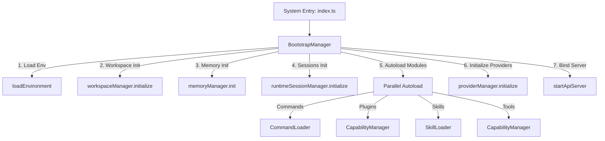
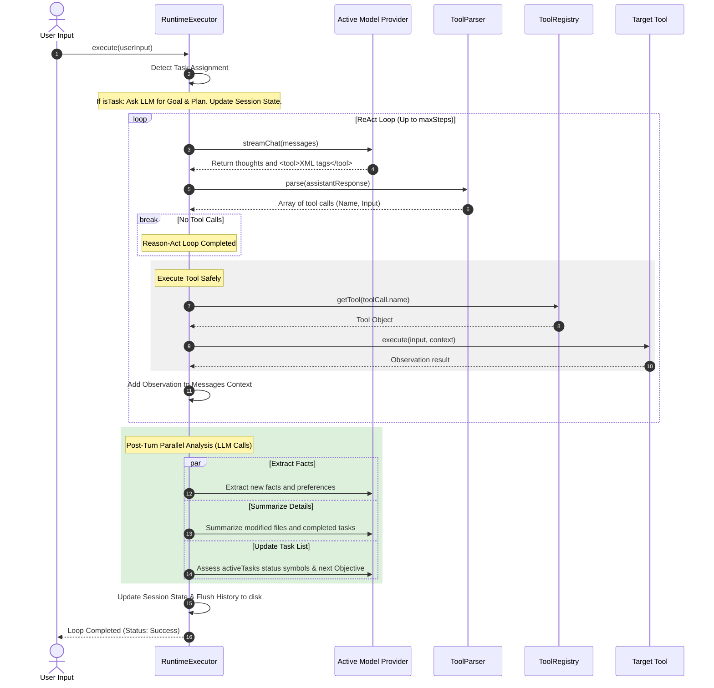
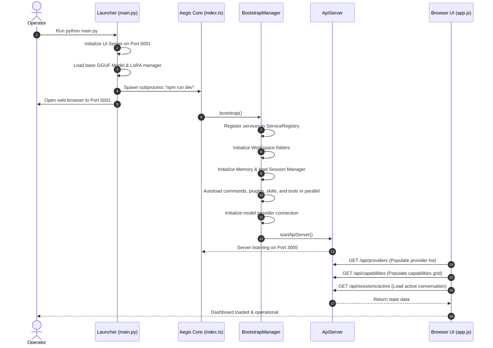
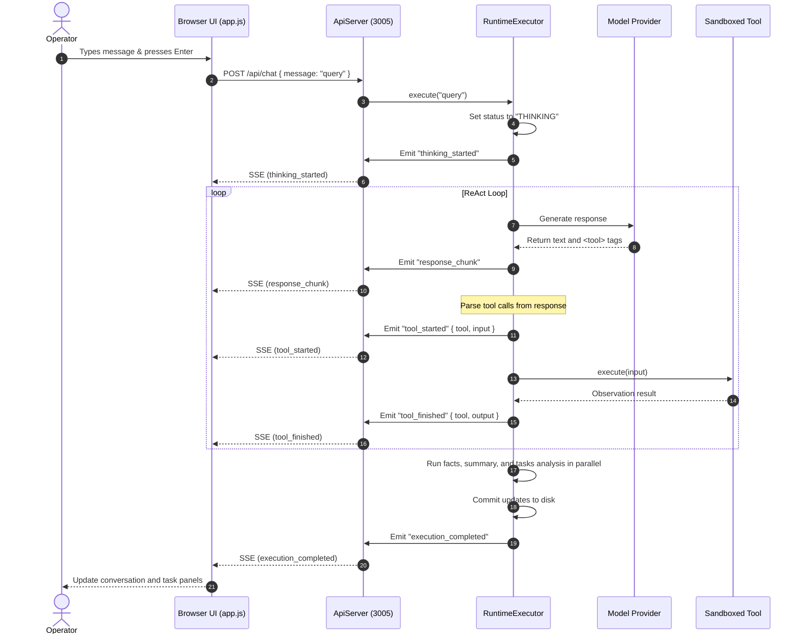

# AEGIS: Decentralized Federated Medical AI System Architecture & Implementation Report

---

## 1. Executive Summary & Vision

**AEGIS** is a next-generation, decentralized, privacy-preserving medical AI ecosystem. In traditional healthcare systems, collaborative training of AI models is bottlenecked by regulatory and privacy constraints (e.g., HIPAA, GDPR). Transporting patient electronic health records (EHRs) to a centralized server presents severe security risks and single-point-of-failure vulnerabilities. 

AEGIS solves these core issues by bringing the AI training to the data instead of the data to the AI. Using a multi-agent hierarchical framework combined with blockchain consensus and selective parameter fine-tuning, hospitals, edge devices, and research institutions can collaboratively train global models while keeping patient records strictly localized.

### Core Security & Privacy Pillars
1. **Federated Learning & Selective LoRA**: Rather than transmitting complete weights, client nodes fine-tune specific Low-Rank Adaptation (LoRA) layers locally. Only these low-rank matrices are shared, drastically reducing communication bandwidth and preventing data leakage.
2. **Trust-Aware Aggregation**: AEGIS weights local updates based not just on data size, but on a dynamic client *Trust Score* calculated from heartbeat consistency, tensor verification, and historical behavior.
3. **Byzantine-Resistant Validation**: Updates are cross-validated by randomized validation servers before being written to an immutable blockchain ledger audit trail.
4. **DP-RAG (Differentially Private Retrieval-Augmented Generation)**: Client-side vector search databases inject controlled noise (Differential Privacy) into retrieved contexts to prevent membership inference attacks.
5. **HL7 FHIR Interoperability**: Built-in support for standardized healthcare exchange ensuring portability across hospital systems.

---

## 2. Monorepo Directory Layout

The Aegis codebase is structured as an NPM Monorepo using workspace workspaces. Below is the comprehensive tree diagram of the project:

```text
aegis/
├── LICENSE                               # MIT License details
├── package.json                          # Monorepo workspaces config (aegis-core, packages/*, terminal UI)
├── package-lock.json                     # Monorepo dependency lockfile
├── install.ps1                           # Automated PowerShell setup script for Windows
├── README.md                             # Global overview documentation
├── aegis_cognitive_memory_redesign.md   # Architectural blueprint for the cognitive memory platform
│
├── aegis-core/                           # Core Agent Runtime Kernel (Node.js/TypeScript)
│   ├── package.json                      # Core dependencies (ollama, commander, react, inquirer, chalk)
│   ├── tsconfig.json                     # TypeScript compilation settings
│   ├── src/
│   │   ├── index.ts                      # Boot entrypoint: initializes BootstrapManager and ApiServer
│   │   ├── agent/                        # AI Reasoning & Planning Loop
│   │   │   ├── Agent.ts                  # Orchestrates chat stream with LLM providers
│   │   │   ├── PromptBuilder.ts          # Assembles instructions, constraints, and memory context
│   │   │   └── MessageFormatter.ts       # Parses message roles and normalizes history
│   │   │
│   │   ├── runtime/                      # Kernel Orchestration Services
│   │   │   ├── BootstrapManager.ts       # Sequential & parallel setup of subsystems on boot
│   │   │   ├── CapabilityManager.ts      # Dynamically adds/removes tools, skills, and plugins
│   │   │   ├── RuntimeExecutor.ts        # The main ReAct (Reason-Act-Observe) loop and post-turn analysis
│   │   │   ├── RuntimeSessionManager.ts  # Session lifecycle controller (checkout, delete, rename, restore)
│   │   │   ├── SessionStateManager.ts    # Tracks goals, objectives, active tasks, and stable facts
│   │   │   └── WorkspaceManager.ts       # Normalizes paths and validates sandbox boundaries
│   │   │
│   │   ├── memory/                       # Cognitive Memory Platform
│   │   │   ├── MemoryManager.ts          # Coordinates tiered memory, compaction, and rollbacks
│   │   │   ├── MemoryGateway.ts          # Thread-safe read/write operations with JSON file locks
│   │   │   ├── MemoryWriteBuffer.ts      # Temporary transaction buffer for writes
│   │   │   ├── ProjectionGenerator.ts    # Compiles JSON state into clean Markdown text for prompts
│   │   │   ├── ProjectionConsistencyValidator.ts # Ensures projections align with actual state
│   │   │   ├── eventbus/                 # Internal pub-sub event bus for memory changes
│   │   │   └── [indexing/search/embedding/locking/transactions/recovery/refinement/etc.]
│   │   │
│   │   ├── api/
│   │   │   └── ApiServer.ts              # REST API on Port 3005; exposes SSE chat stream
│   │   │
│   │   └── [commands/context/events/plugins/providers/skills/tools/transports/types/utils/]
│   │
│   └── bin/
│       └── aegis.js                      # CLI script link for aegis binary execution
│
├── packages/                             # Shared Library Packages
│   ├── aegis-runtime/                    # Common runtime types, structured logger, and performance monitors
│   ├── aegis-skills/                     # Context and loading abstractions for LLM behavioral flows
│   └── aegis-tools/                      # Dynamic loaders, action routers, and schema checkers for system tools
│
├── UI/                                   # Frontend Desktop Dashboard Interface
│   ├── index.html                        # 3-column dashboard (Sessions list, Chat, Inspector, Console pages)
│   ├── style.css                         # Dark-mode styling, glassmorphism UI, transitions, and palettes
│   ├── app.js                            # Connects UI buttons/events to ApiServer (3005) & Python backend (5001)
│   ├── main.py                           # Python Server (Port 5001) - launches UI, GGUF/LoRA inference model, Node.js process
│   └── aegis-logo.jpeg                   # Graphic asset for application branding
│
├── skills/                               # LLM-Backed Higher-Level Behaviors
│   ├── shared/
│   │   ├── extract/                      # Structured JSON data extraction with custom templates
│   │   ├── format/                       # Normalization and styling formatter skill
│   │   ├── generate/                     # Automated content and code generation skill
│   │   └── summarize/                    # Dense text compaction and key-fact abstraction skill
│   └── README.md
│
├── tools/                                # Sandboxed OS & Memory Interaction Capabilities
│   ├── shared/
│   │   ├── FileTool/                     # System actions: create, read, write, append, and delete files
│   │   ├── FolderTool/                   # System actions: create, delete, and list folders
│   │   ├── TerminalTool/                 # System actions: execute command-line shell commands
│   │   ├── MemoryTool/                   # System actions: clear, save, and retrieve key-value memory blocks
│   │   ├── SystemTool/                   # System actions: return hardware statistics (RAM, CPU, locks)
│   │   └── [memory-read/memory-write/memory-delete]
│   └── README.md
│
├── plugins/                              # Middleware Extensions
│   ├── shared/
│   │   ├── encryption/                   # AES-GCM-256 local state encryption hooks
│   │   ├── cache/                        # Memory cache provider
│   │   ├── synchronization/              # Decentralized state syncing adapter
│   │   └── [logging/analytics/monitoring/notifications/persistence/telemetry/auth]
│   └── README.md
│
├── providers/                            # Model Backend Connectors
│   ├── local/ollama/                     # Ollama model interface
│   ├── local/gguf/                       # Direct LlamaCpp-Python GGUF runtime
│   ├── api/openai-compatible/            # Commercial API standard endpoint wrapper
│   └── mock/                             # Mock provider for testing and offline debugging
│
├── templates/                            # Scaffolding Templates for New Capabilities
│   └── [command/plugin/provider/skill/tool]
│
├── workspace/                            # Local sandbox directories for execution
│   ├── shared/                           # Sandbox execution root
│   ├── memory/                           # DB files (history, session state, graph nodes, caches)
│   │   ├── sessions/                     # Active session workspaces
│   │   └── trash/                        # Quarantined deleted sessions
│   └── reports/                          # Generated documents and analysis reports
│
└── tests/                                # System Validation Suite
    ├── unit/                             # Test cases for EventBus, MemoryManager, CheckpointManager, etc.
    ├── integration/                      # Live session-switching and concurrent execution tests
    ├── stress/                           # Stress-testing execution hooks under high loads
    └── recovery/                         # Crash simulation and automatic rollback tests
```

---

## 3. Subsystem Deep-Dive

### 3.1. Core Orchestration Engine (`aegis-core/src/runtime`)

The Core Engine coordinates the boot sequence, handles capability mounting, tracks session states, and runs the main reasoning execution loop.



#### BootstrapManager (`BootstrapManager.ts`)
The `BootstrapManager` is the boot kernel of AEGIS. It performs startup procedures in a precise sequence:
1. Registers services (EventBus, Config, Memory managers, Workspace managers) in the global `ServiceRegistry`.
2. Establishes core system-level event triggers (such as graceful shutdown signals).
3. Evaluates workspace directories, creating standard folders if missing.
4. Initializes the `MemoryManager` and `RuntimeSessionManager`.
5. Spawns parallel autoload loaders for:
   * **Memory modules** (discovering and compiling indexing engines).
   * **Commands** (mounting slash commands).
   * **Plugins** (activating telemetry, encryption, and sync adapters).
   * **Skills** (loading prompts and code).
   * **Tools** (mounting sandboxed system functions).
6. Tests network connections to model providers and triggers warning alarms if models are unreachable.

#### CapabilityManager (`CapabilityManager.ts`)
The `CapabilityManager` allows hot-swapping agent features at runtime. It monitors active capabilities and interfaces with the `ToolRegistry`, `SkillRegistry`, and `PluginRegistry` to add or remove capabilities dynamically when commanded by the API.

#### RuntimeExecutor (`RuntimeExecutor.ts`)
The `RuntimeExecutor` runs the **ReAct (Reasoning and Action)** execution loop. 



1. **Task Assignment Check**: Evaluates if the query is a command/task request (e.g., "create file", "modify database", "delete folder").
2. **Goal & Planning**: If it is a task, it issues an LLM pre-prompt to formulate:
   * A **Goal** (e.g., "Delete target directory").
   * A **Current Objective** (e.g., "Locate containing folder and execute recursive delete").
   * An **Active Tasks List** (e.g., `["[!] Locate target folder", "[ ] Check child items", "[ ] Run deleteFile tool"]`).
   * An **Implementation Plan** (e.g., detailed steps to modify directories).
3. **ReAct Loop Execution**:
   * Assembles conversation history, system instructions, and active goals.
   * Feeds the context to the active LLM provider.
   * Parses the streamed response for `<tool>{"name": "...", "input": {...}}</tool>` tags using the `ToolParser`.
   * Invokes the tool via the registry, executes the sandbox action, collects the result, and appends it as a `tool` role message in the context.
   * Continues until the LLM yields no more tool calls.
4. **Post-Turn Analysis**: When the loop concludes, the executor schedules three LLM analysis tasks *in parallel* to keep memory clean:
   * **Fact Extraction**: Captures key constraints or user preferences.
   * **Details Summary**: Captures a description of files modified or actions taken.
   * **Task Status Evaluator**: Updates task progress symbols:
     * `[!]` -> Running / Next active task.
     * `[✓]` -> Completed task.
     * `[✗]` -> Failed task.
     * `[ ]` -> Pending task.
5. **Disk Commit**: Commits state updates and writes the formatted conversation history back to the session database.

#### SessionStateManager (`SessionStateManager.ts`)
Maintains metadata and task logs, and builds snapshots. When a user requests a session checkout, the `SessionStateManager` unmounts the current session, performs checksum validation, loads the target session history, and updates the local Markdown projections.

---

### 3.2. Cognitive Memory Subsystem (`aegis-core/src/memory`)

AEGIS implements a tiered, transaction-backed cognitive memory platform. 

```
┌────────────────────────────────────────────────────────────────────────┐
│                        COGNITIVE MEMORY PIPELINE                       │
├────────────────────────────────────────────────────────────────────────┤
│ 1. Active Short-Term Context                                           │
│    - working-memory.md (Current goals, plans, extracted details)       │
│    - history.json (Raw chronological message logs)                     │
├────────────────────────────────────────────────────────────────────────┤
│ 2. Semantic Search Layer                                               │
│    - Local HNSW Vector database index + BM25 keyword search index      │
│    - Automatically updates via Background Embedding generators         │
├────────────────────────────────────────────────────────────────────────┤
│ 3. Relational Knowledge Graph                                          │
│    - entities.json (Maps Patients, Doctors, Hospitals, and LoRA nodes) │
├────────────────────────────────────────────────────────────────────────┤
│ 4. Transactional File Gateway                                          │
│    - Writes protected by Mutex locks and rollback journals             │
└────────────────────────────────────────────────────────────────────────┘
```

#### MemoryGateway (`MemoryGateway.ts`)
Ensures file system integrity.
* **Concurrent Lock Manager**: Uses file locks to queue read/write operations and prevent race conditions.
* **Transaction Rollback Journals**: Writes state changes to a temporary write buffer (`MemoryWriteBuffer`). If a write fails mid-operation, the gateway recovers the original state using rollback journals.
* **Point-in-Time Snapshots**: Periodically saves complete memory states as `.snap` files. If a file checksum fails on boot, the `MemoryRecoveryManager` automatically rolls back to the latest valid snapshot.

#### ProjectionGenerator (`ProjectionGenerator.ts`)
LLMs parse raw JSON files inefficiently. The `ProjectionGenerator` translates structured data (e.g., task lists, facts, active variables) into a clean, human-readable Markdown projection file (`working-memory.md`) which is injected directly into prompt templates, saving context tokens.

#### EventBus & Handlers (`aegis-core/src/memory/eventbus`)
Changes to memory files publish events (e.g., `workingMemory.updated`, `session.archived`). Subscribed background handlers process these events asynchronously:
* **EmbeddingHandler**: Extracts text updates, generates vector representations using Ollama/GGUF, and inserts them into the vector database.
* **AuditLogger**: Creates signed audit records of data access for clinical compliance verification.

---

### 3.3. Interface and Communication Layer (`aegis-core/src/api`)

The api server provides a REST interface for frontend dashboards:

| Method | Endpoint | Description |
| :--- | :--- | :--- |
| **GET** | `/api/sessions` | Lists all active and inactive sessions on disk. |
| **POST** | `/api/sessions` | Creates a new isolated session folder and registers its metadata. |
| **POST** | `/api/sessions/checkout` | Switches the active session, loading its history and objectives. |
| **POST** | `/api/sessions/rename` | Updates session display names and descriptions. |
| **POST** | `/api/sessions/delete` | Moves a session folder to the quarantine trash directory. |
| **GET** | `/api/trash` | Lists sessions located in the trash folder. |
| **POST** | `/api/trash/restore` | Moves a session back from trash to active status. |
| **POST** | `/api/trash/empty` | Permanently deletes all folders in the trash directory. |
| **GET** | `/api/capabilities` | Returns active and inactive Tools, Skills, and Plugins. |
| **POST** | `/api/capabilities/add` | Mounts and registers a capability. |
| **POST** | `/api/capabilities/remove` | Unmounts and deactivates a capability. |
| **GET** | `/api/providers` | Lists model connection backends and indicates which is active. |
| **POST** | `/api/providers/switch` | Switches the active model provider. |
| **POST** | `/api/chat` | Receives client messages and returns streamed agent outputs using SSE. |

#### Server-Sent Events (SSE) Stream Protocol
The `/api/chat` endpoint handles client connections using Server-Sent Events (`text/event-stream`). As the ReAct loop runs, the API server transmits real-time event updates:
1. `event: execution_started` — indicates that the agent has started processing the query.
2. `event: thinking_started` — indicates that the LLM is generating reasoning steps.
3. `event: response_chunk` — streams chat output content chunks.
4. `event: tool_started` — indicates that a tool has been invoked (includes arguments).
5. `event: tool_finished` — indicates that tool execution has finished (includes output observations).
6. `event: execution_completed` — closes the connection.

---

### 3.4. Shared Monorepo Packages (`packages/`)

To keep code modular, core functionality is separated into packages:

1. **`aegis-runtime`**:
   * Declares interfaces and type definitions (e.g., `Command`, `Message`, `Tool`).
   * Configures environmental variables and structured loggers.
   * `PerformanceMonitor`: Tracks system speed (e.g., tool execution time, model latency) and exports telemetry logs.
   * `pathSandbox`: Validates path inputs, ensuring that tools can only access files within the designated workspace directory.

2. **`aegis-skills`**:
   * Registers skill sets and injects dependencies.
   * `SkillLoader`: Dynamically loads skill folders, validates their `skill.json` files, and runs their execution scripts.
   * `SkillContext`: Provides executing skills with access to system logging, model providers, and configuration scopes.

3. **`aegis-tools`**:
   * Orchestrates lower-level tools.
   * `ToolLoader`: Reads `tool.json` and imports action functions.
   * `ToolRegistry`: Manages active tool instances. If a tool contains multiple actions, `ToolRegistry` routes incoming inputs to the appropriate function.

---

### 3.5. Sandbox Capabilities & Middleware Registry

AEGIS provides custom extensions to adapt the agent's capabilities.

#### Skills (`skills/`)
Skills are high-level behaviors that utilize LLMs. A skill directory contains:
* `skill.json` (metadata, entrypoint path).
* `permissions.json` (access definitions).
* `execute.ts` (execution script).
* `prompts/` (LLM prompt templates).

*Example (Extract Skill)*: The `extract` skill accepts text and a JSON schema. It reformats the schema, instructs the LLM to extract matching fields, validates the output, and returns structured data.

#### Tools (`tools/`)
Tools are low-level sandboxed actions.
* **FileTool**: Actions: `read`, `write`, `append`, `deleteFile`. Restricts operations to files within the workspace path using `pathSandbox`.
* **FolderTool**: Actions: `create`, `delete`, `list`. Returns directory listings and size statistics.
* **TerminalTool**: Action: `exec`. Runs shell commands using Node's `child_process`.
* **MemoryTool**: Actions: `save`, `retrieve`, `clear`. Directly writes key-value pairs to the local memory cache.
* **SystemTool**: Action: `stats`. Returns memory usage, CPU load, active sessions count, and mutex file lock statuses.

#### Plugins (`plugins/`)
Plugins act as middleware. They register initialization and shutdown hooks that run during system boot and shutdown:
* `encryption`: Encrypts local session folders at rest.
* `telemetry`: Monitors and logs token counts, query times, and tool calls.
* `synchronization`: Pushes encrypted session updates (diff logs) to remote validation nodes.

---

### 3.6. Model Providers (`providers/`)

Providers connect the agent to inference backends:
* **`local/ollama`**: Interfaces with local Ollama APIs.
* **`local/gguf`**: Bypasses external servers to execute models locally using LlamaCpp-Python. It supports attaching or detaching LoRA adapters dynamically.
* **`api/openai-compatible`**: Connects to commercial model endpoints.
* **`mock`**: Returns pre-configured mock answers and simulates tool calling for testing.

---

### 3.7. Desktop Dashboard Frontend (`UI/`)

The front-end user interface is launched using a Python server and displays real-time agent telemetry.

```
┌────────────────────────────────────────────────────────────────────────┐
│                        AEGIS ENTERPRISE DASHBOARD                      │
├──────────────────────┬──────────────────────────┬──────────────────────┤
│ Left Sidebar         │ Main Workspace           │ Right Inspector      │
│                      │                          │                      │
│ - New Session Button │ - Objective Banner       │ - Session Details    │
│ - Search Input       │ - Local GGUF Settings    │   (ID, Created, Node)│
│                      │ - Chat Viewport (Stream) │ - Session Actions    │
│ - Console Pages:     │ - Live Activity Log      │   (Rename, Delete,   │
│   (Home, Skills,     │ - Input Textarea         │    Export)           │
│    Tools, Plugins,   │ - Hotkeys                │ - Danger Zone        │
│    Logs, Trash)      │                          │   (Delete All)       │
└──────────────────────┴──────────────────────────┴──────────────────────┘
```

#### Launcher & Inference Host (`main.py`)
`main.py` coordinates the application components:
1. **Static UI Host**: Starts a thread-safe Python HTTP server on port 5001 to serve the dashboard's HTML, CSS, and JS files.
2. **Local GGUF Executor**: Loads a local GGUF model (`model.gguf`) using `llama-cpp-python`. It exposes REST endpoints `/api/gguf/chat` and `/api/gguf/lora/config` to stream chat inferences and attach/detach LoRA adapter files (e.g., clinical fine-tuning weights).
3. **Core Subprocess Coordinator**: Spawns the Node.js dev server (`npm run dev`) inside the `aegis-core/` directory as a background subprocess, capturing and routing its logs to the launcher console.
4. **Browser Launcher**: Opens the user's default web browser to `http://127.0.0.1:5001`.
5. **Termination Handler**: Intercepts `Ctrl+C` and termination signals to shut down the Node.js and GGUF subprocesses cleanly.

#### Frontend Dashboard (`index.html`, `app.js`, `style.css`)
* **3-Column Frame**: A dark-themed layout featuring a left navigation panel, a central chat screen, and a right inspector panel.
* **Console Pages**: Includes pages for managing active sessions, checking out/deleting trash, and activating or deactivating skills, tools, and plugins.
* **Live Action Log**: Displays real-time updates of tool invocations, inputs, and observation outputs as they occur in the backend.

---

## 4. System Execution Traces

### Trace A: System Boot sequence



### Trace B: Conversation Turn Execution



---

## 5. Future Roadmap

1. **Swarm Intelligence**: Connecting multiple local client nodes directly to support peer-to-peer federated learning validation without requiring intermediary coordination servers.
2. **Lightweight Edge Consensus**: Optimizing verification algorithms to run consensus validation on mobile and edge devices with minimal battery consumption.
3. **Adaptive Context Pruning**: Implementing dynamic context compression models that summarize old messages based on relevance to the current objective.
4. **Enhanced FHIR Profile Mapping**: Adding support for custom HL7 healthcare profiles to automate patient data parsing.
