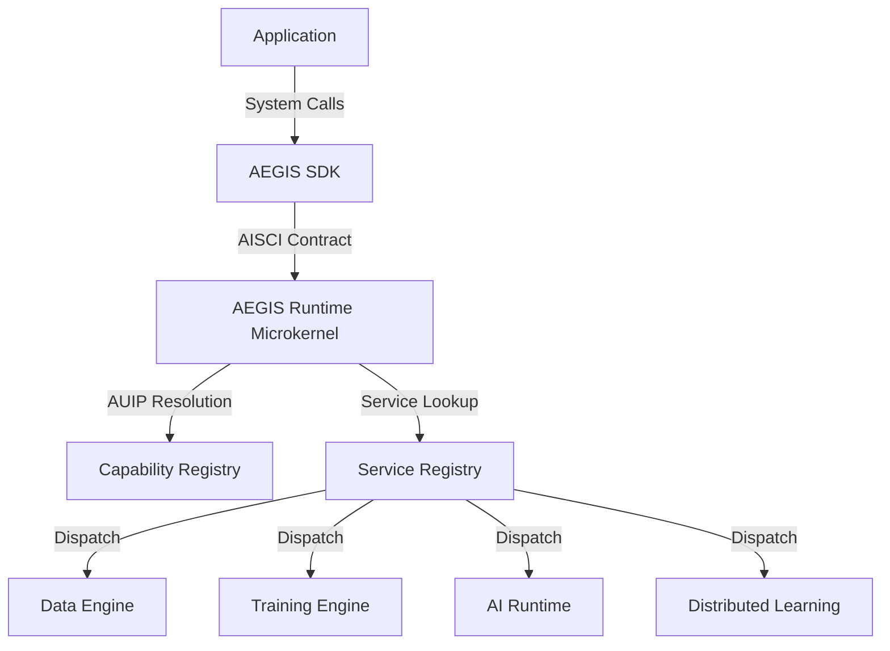

# AEGIS Software Development Kit (ASDK) & AI System Call Interface (AISCI)

Welcome to the official developer documentation for the **AEGIS Software Development Kit (ASDK)** and **AI System Call Interface (AISCI)**. 

The ASDK is the stable application programming boundary for the AEGIS ecosystem, shielding developers from the complexity of individual engine configurations. Applications communicate with the AEGIS operating system solely via the AISCI boundary.

---

## Architecture Overview



Applications request **intelligence capabilities** (e.g., "generate text", "recall memory", "optimize weights") instead of targeting specific engine implementations. The Runtime resolves and routes requests dynamically.

---

## Installation

### TypeScript / JavaScript
Install the monorepo package directly:
```bash
npm install @aegis/sdk
```

---

## Authentication & Session Management

All operations propagate a session envelope carrying Correlation IDs, Node IDs, and User IDs for platform auditing.

```typescript
import { AegisSDK } from '@aegis/sdk';

// Initialize the SDK client
const aegis = await AegisSDK.initialize({
  endpoint: 'http://localhost:8080',
  apiKey: 'aegis_key_abc123',
  transport: 'loopback' // Use 'loopback' for in-memory desktop integration, 'mock' for testing
});

// Configure active session parameters
aegis.setSession('session-clinical-trial-9', 'user-radiologist-101');
```

ASDK supports multiple authentication paradigms:
* **API Keys & Bearer Tokens**: Configured on initialization.
* **Mutual TLS (mTLS)**: Handled automatically over WebSocket/gRPC transports.
* **SSO & Certificate Identity**: Checked at the microkernel policy gate.

---

## System Call Categories

### 1. Runtime & Node Information
Query microkernel health and hardware configurations.
```typescript
const version = await aegis.version();
const health = await aegis.runtimeHealth(); // returns { status: 'HEALTHY' }
```

### 2. Dataset Management
Interact with ingestion pipelines abstracted from the underlying storage drivers.
```typescript
const dataset = await aegis.createDataset('patient-records-v1', '/raw/mammography/dicom');
```

### 3. Training & Optimization
Queue local training, fine-tuning, and model evaluations.
```typescript
const job = await aegis.createTrainingJob('job-mam-density', 'patient-records-v1');
const lora = await aegis.exportLoRA('job-mam-density');
```

### 4. AI Inference
Generate text, retrieve embeddings, and load adapters dynamically.
```typescript
const result = await aegis.generate('Analyze density findings: Category 4');
console.log(result.text);
```

### 5. Memory Gateway
Read, write, and search persistent cognitive semantic memories.
```typescript
await aegis.storeMemory('patient-102-notes', 'Benign dense tissue diagnosed');
```

### 6. Swarm & Federated Learning
Initialize learning rounds and swarm consensuses.
```typescript
await aegis.createLearningRound('round-cons-mammography-2');
```

---

## Transport Abstraction Layer

Transports are decoupled from the API layer through the `ITransportClient` contract:
* **IPC (Inter-Process Communication)**: Default low-latency channel for local desktop installations.
* **REST**: Used for simple request/response system calls.
* **WebSockets**: Ideal for long-lived bidirectional streams (event streams, training telemetry, token generations).
* **gRPC**: Enterprise-grade cloud/microservice deployments.
* **LoopbackTransport**: Bypasses network serialization by directly querying the Runtime container `serviceRegistry` (ideal for lightning-fast integration tests).
* **MockTransport**: Simulates microkernel returns for isolated local unit tests.

---

## Unified Exception Model

The ASDK maps platform failures to a standardized, language-agnostic exception hierarchy:

| Exception Class | Description |
| :--- | :--- |
| `RuntimeUnavailable` | Microkernel is offline or crashed. |
| `NodeOffline` | Target peer node is unreachable. |
| `PackageNotInstalled` | Required engine is not installed on the node. |
| `EngineUnavailable` | Engine is registered but disabled. |
| `FeatureUnavailable` | Requested system call is missing (enables Graceful Degradation). |
| `PolicyViolation` | Rejected due to cluster/privacy constraints. |
| `PermissionDenied` | Invalid authentication token or signature validation. |

Example:
```typescript
try {
  await aegis.createSwarm('mam-swarm');
} catch (err) {
  if (err instanceof FeatureUnavailable) {
    console.warn("Swarm learning engine is absent. Local operations only.");
  }
}
```

---

## Language Bindings

Equivalently structured libraries are provided for multi-language development:

### Python Reference
Located in `src/bindings/python/aegis_sdk.py`:
```python
from aegis_sdk import AegisSDK

aegis = AegisSDK.initialize(api_key="your_key")
res = aegis.generate("Analyze clinical trial notes")
print(res["text"])
```

### C++ Reference
Located in `src/bindings/cpp/aegis_sdk.hpp`:
```cpp
#include "aegis_sdk.hpp"

auto aegis = aegis::AegisSDK::initialize("localhost:8080", "key");
std::string res = aegis.generate("Query radiology checklist");
```
